# Spaced Penguin Architecture

**Status:** Current architecture reference

**Audience:** Software architects, maintainers, game/system developers, and level-tooling developers

**Last verified:** 2026-08-15 against the repository source

**Scope:** The browser-based HTML5 rewrite. `OldSource/` is reference material, not a runtime dependency.

## 1. Executive summary

Spaced Penguin is a client-only, static web game. The browser loads one HTML page and an ES-module graph; there is no build step, application server, database, or current network API beyond static-file `fetch` calls. The game uses a fixed 800 x 600 logical display surface with an optional level camera over a larger world-space playfield, renders into a backing buffer sized for the viewport and device pixel ratio, loads a manifest of images and audio, loads 25 JSON level definitions, and then runs a `requestAnimationFrame` update/render loop.

The central `Game` object is both the runtime aggregate and the main coordinator. It owns gameplay state, entity collections, physics registration, scoring, UI overlays, the level editor, fullscreen support, and level transitions. `GameManager` owns browser lifecycle concerns: bootstrap, responsive display sizing, page visibility, the frame loop, and construction of the state-aware input router.

The architecture favors direct browser execution and fidelity to the original Shockwave game over framework abstraction. This keeps deployment and iteration simple, but concentrates responsibilities in `Game` and permits some global access through `window`. Gameplay transitions now live in a deterministic, environment-independent simulation core shared exactly by the browser adapter and Node headless runner, while browser-only rendering and effects remain at the edge.

## 2. System context

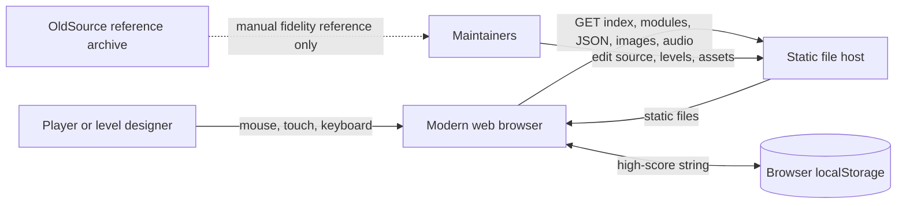

### External inputs

| Input | Format | Consumer | Notes |
|---|---|---|---|
| Player input | DOM mouse, touch, keyboard, click, resize, visibility events | `InputManager`, registered input contexts, `Game`, `UIManager`, `FullscreenManager` | Contexts own activation and handling; the manager only orders and dispatches. |
| Asset catalog | `assets/manifest.json` | `AssetLoader` | Resolves images, SVGs, sprite sheets, and WAV files. |
| Level definitions | `levels/level01.json` through `level25.json` | `LevelLoader` | Loaded at startup and held in an in-memory `Map`. |
| Level discovery catalog | Shipped definitions, `localStorage.spacedPenguinSavedLevels`, and the optional community API | `LevelCatalogService`, `LevelBrowserScreen` | Official, owned, and community sources share asynchronous summary paging while details and playable definitions resolve separately. |
| URL level selector | `?level=N` | `GameManager` / `Utils` | Numeric selectors address the 25-level shipped catalog; `manual:N` selects the archived 20-level catalog. |
| High scores | `localStorage.spacedPenguinHighScores` plus legacy best-score key | `HighScoreStore` / `Game` | Local all-time and today top-ten entries; no network submission. |

### Outputs

| Output | Destination | Notes |
|---|---|---|
| Game and editor graphics | Canvas 2D plus DOM overlays | The logical display remains 800 x 600; an optional camera views larger level stages while the backing buffer follows display resolution. |
| Sound | Web Audio API destination | Decoded WAV buffers are played through per-sound gain nodes. |
| High score | Browser `localStorage` | No online leaderboard or remote score submission exists in the rewrite. |
| Saved editor levels | Browser `localStorage` | Local records contain metadata, a thumbnail, and the authored definition. Catalog consumers receive only summaries until details or playable data are requested. |
| Exported level | Downloaded JSON | Export and Ctrl+S are client-side JSON downloads; there is no server persistence. |
| Diagnostics | Browser console and in-game console/logger | `window.game` and `window.gameManager` expose debugging entry points. |

## 3. Deployment and execution model

The deployable unit is the repository's static content. A compliant static server must preserve relative paths and serve JavaScript modules, JSON, images, SVG, and WAV files. Opening `index.html` directly from `file://` is not supported reliably because module and `fetch` security policies vary by browser.

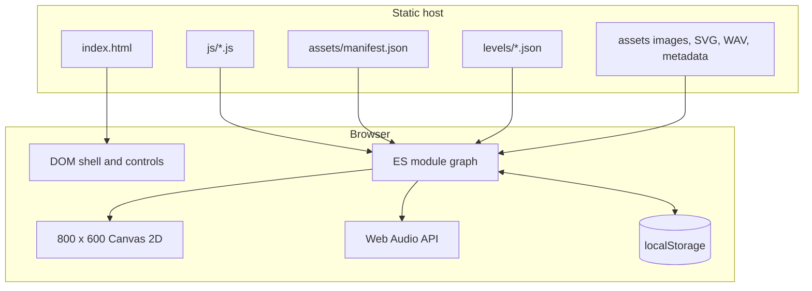

There is no runtime bundler, transpiler, production package dependency, service worker, backend, authentication, or telemetry service. Browser support therefore depends directly on native ES modules, Canvas 2D, `fetch`, `Map`, optional chaining, Web Audio, Fullscreen, and related contemporary APIs. Development uses pinned Playwright tooling, and GitHub Actions runs the repository's automated quality gates.

## 4. Component model and ownership

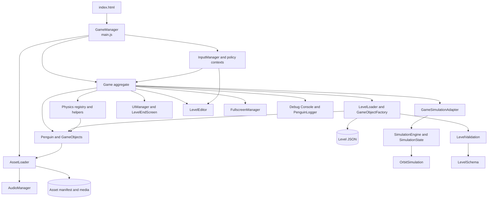

| Component | Primary responsibility | Important collaborators | Architectural notes |
|---|---|---|---|
| `index.html` | DOM shell, HUD, canvas, responsive CSS, module entry | `main.js` | Logical canvas size is declared here. |
| `GameManager` (`main.js`) | Browser bootstrap, frame scheduling, visibility handling, viewport scaling, start screen | `AssetLoader`, `Game`, `InputManager` | Owns the outer lifecycle; published as `window.gameManager`. |
| `Game` (`game.js`) | Runtime aggregate, level/attempt lifecycle, effects, UI coordination, and render pipeline | Nearly all runtime components | Gameplay transition policy is delegated to the simulation core, but `Game` remains the main integration hotspot. |
| `AssetLoader` | Manifest loading, ordered resource loading, caches, visual fallbacks | `AudioManager` | Loads all manifest assets sequentially; “essential” changes order and fallback behavior, not whether an asset loads. |
| `AudioManager` | Audio context, decode/cache, playback, volume | Web Audio API | Audio context construction/resume can be constrained by autoplay policy; failures disable audio without blocking graphics. |
| `InputManager` | Register contexts and dispatch each DOM event in deterministic priority order | Input contexts, DOM/window | Contains no game/editor/UI activation logic. The first claiming context stops routing unless it explicitly returns `PASS`. |
| `LevelSchema` | Shared level-format vocabulary and runtime capability configuration | Validator, loader, editor | Owns canonical object/orbit types, aliases, normalization, and orbit lookup target types. |
| `LevelValidation` | Pure structural and semantic validation with typed diagnostics | `LevelSchema` | Has no DOM, game-object, fetch, or filesystem dependencies; shared by browser and Node loaders. |
| `LevelLoader` | Fetch/validate/cache level JSON and instantiate a level into `Game` | Validator, factory, rules, entities, physics | Rejects invalid content before caching/mutation and uses two-pass orbit resolution. |
| `LevelCatalogService` | Source-neutral discovery, cursor paging, search, detail lookup, and definition lookup | Official, local, and optional community catalog sources | Keeps card summaries separate from rich details and playable JSON; source cursors are opaque to the UI. |
| `LevelBrowserScreen` | Async level discovery and context-aware play/open UI | `LevelCatalogService`, `Game`, `UIManager` | Owns source tabs, query/loading/error/detail state, debounced search, incremental pages, context-specific actions, unsaved-editor confirmation, focus containment, and lazy thumbnails. |
| `LevelSaveService` | Create or update locally owned editor records | `LocalLevelRepository`, save strategy pipeline | Persists local definitions and metadata; read/discovery behavior belongs to the catalog boundary. |
| `GameObjectFactory` | Validated JSON-to-runtime entity mapping and orbit configuration | Entity constructors, `LevelSchema` | Supports canonical types plus configured text/arrow aliases; exported penguin state is intentionally ignored. |
| `SimulationEngine` | Deterministic fixed-step world advancement and domain events | State, geometry, gravity, orbit simulation | Exposes an immutable browser API and the same mutable kernel for optimized headless sessions; authoritative for flight, crash, collision, bonuses, target outcomes, rules, launch math, and scoring. |
| `SimulationState` | Normalized serializable world contract and reset/clone operations | Level validator, simulation engine | Separates deterministic gameplay data from rendering objects and browser services. |
| `CompiledWorldTimeline` | Exact fixed-step world-state cache for repeated headless candidates | Orbit simulation, simulation state | Stores positions plus orbit angle/velocity in compact `Float64Array` buffers; it changes evaluation cost, not gameplay semantics. |
| `GameSimulationAdapter` | Translate live browser objects to/from simulation state and events | `Game`, simulation engine | Effects such as audio, popups, target animation, and UI remain outside the pure core. |
| `OrbitSimulation` | Pure parametric/gravity orbit stepping and dependency-ordered graph resolution | Simulation engine, `OrbitSystem` adapter | Resolves parents recursively, independent of JSON declaration order. |
| `Physics` | Runtime registries and trace/legacy helper compatibility | Loader, renderer | It is no longer the authoritative gameplay integrator. |
| `Penguin` | Character visual/animation state and live position facade | Game adapter, assets | Simulation owns movement; the adapter keeps parallel `x`/`y` and `position` access synchronized. |
| `GameObject` hierarchy | Entity visuals and non-simulation animation | `Game`, assets, adapter | Orbit positions are applied by simulation during normal frames, preventing double advancement. |
| `OrbitSystem` | Runtime/editor orbit configuration facade | Shared `OrbitSimulation` | Direct calls delegate to the same pure orbit step used by browser and headless simulation. |
| `UIManager` | Stack of Canvas UI screens and input dispatch | `LevelEndScreen`, audio | Rendered above game entities and below the editor overlay. |
| `LevelEndScreen` | Animated score breakdown and continue/retry actions | `Game`, `UIManager` | Drives transitions out of `SCORING`. |
| `LevelEditor` | Coordinates in-browser object creation, selection, property editing, play/edit mode, and export | Editor views/controllers, command history, `Game` | Mutates the live runtime graph directly; it is not a separate model. |
| `FullscreenManager` | Fullscreen DOM and scaling behavior | Canvas/container | Uses vendor-prefixed fallbacks in addition to the standard API. |
| `PenguinLogger` / `Console` | Themed logs and debug commands | DOM and global runtime handles | Operational diagnostics, not durable telemetry. |
| `PerformanceUtils` | Frame-time tracking and browser timing helpers | `GameManager` | The main loop records capped frame durations. |

### Configuration ownership

Shared policy is split by domain under `js/config/`. `gameConfig.js` owns the world, catalog, generator, simulation, physics, and level defaults; the adjacent runtime, render, UI, input, editor, asset, and audio modules own their respective browser concerns. The Node trajectory tooling has a separate `testing/trajectoryConfig.js` because its search budgets and terminal output are not product behavior. Frozen configuration is consumed directly; `globalConstants.js` remains only as a compatibility view for older imports.

Level JSON remains the source of authored content. `LevelSchema.normalizeLevelDefinition` merges shared defaults with authored values using nullish semantics before the loader, runtime factory, editor, or simulation state consumes them. This keeps browser and headless behavior aligned and preserves explicit zero/false overrides.

## 5. Bootstrap and lifecycle

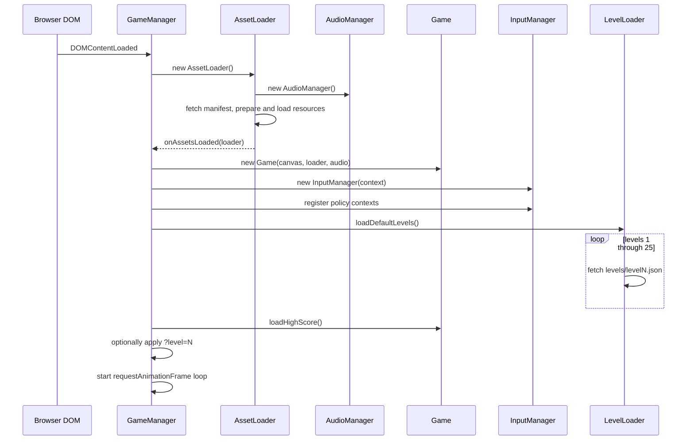

Important bootstrap properties:

- The manifest and every listed asset are attempted before `Game` is constructed. A failed essential visual receives a generated canvas fallback; failed nonessential media is logged and omitted.
- Level files are loaded serially. A missing or invalid level is absent from the cache and is generated procedurally when requested.
- `AssetLoader` constructs the actual `AudioManager`. Although `main.js` imports `AudioManager`, it obtains the shared instance from the loader.
- The recurring frame callback is scheduled before the loop checks `isRunning` and page visibility. Hidden pages skip work; the first frame after visibility resumes resets timing to avoid a large delta.
- Display-frame time is capped to 1/30 second and accumulated across renders. `GameManager` advances the entire simulation world only in exact 1/60-second ticks, including moving/hierarchical orbits, gravity, collision, bonuses, bounds, and rules. Rendering remains display-driven, so copied headless trajectories have the same outcome at high or irregular display refresh rates.
- `GameManager` owns a single cancellable animation-frame request. Visibility pause/resume is idempotent and does not start parallel frame chains.

## 6. Runtime update and render flow

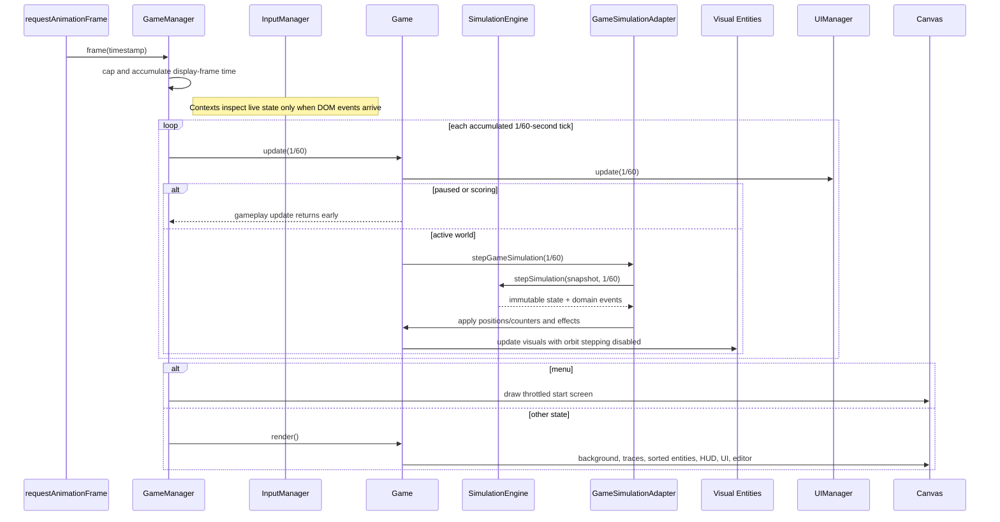

### Render order

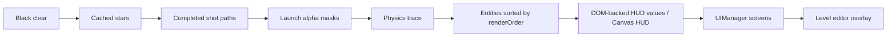

`Game` caches the render-order sort and invalidates it through `addGameObject`, `removeGameObject`, or explicit level-load invalidation. Code that mutates `gameObjects` directly must also set `_gameObjectsChanged`, or drawing order can remain stale.

### Deterministic simulation path

`stepSimulation(state, delta)` is the authoritative immutable gameplay transition. It clones its input and delegates to `stepSimulationMutable`, the same transition kernel used by optimized headless sessions. The kernel divides elapsed time into maximum 1/60-second slices, advances the dependency-ordered orbit graph, then handles penguin state. A soaring slice checks pre-move planet collision, integrates gravity/movement, accumulates distance, collects bonuses, evaluates target victory, checks flight bounds, and emits failure events. A crashed slice advances bounce motion and emits an attempt-reset event when its deterministic legacy-frame countdown ends.

The result is `{ state, events }`. State contains only gameplay data; events include movement, bonus collection, planet collision/bounce, target success/blocking, bounds exit, rule failure, and reset requests. `GameSimulationAdapter` applies state to browser objects and turns events into effects. `HeadlessGameEngine` invokes the same mutable kernel with browser-only movement observations disabled, so it is a runner rather than a second physics implementation.

For a trajectory sweep, world motion is candidate-independent: planets, bonuses, and the target never react to the penguin. `CompiledWorldTimeline` therefore advances the same orbit graph once for every fixed step and stores exact positions and mutable orbit fields. Each candidate owns a fresh mutable penguin/bonus/counter state, applies the corresponding world frame, and invokes the shared kernel with orbit advancement disabled. Timeline frames follow the production ordering—world advance first, then collision/gravity/bonus/target evaluation. Optional worker threads each own their timeline and candidate subset; results are restored to canonical grid order before returning.

The headless engine sizes a timeline from `floor(maxTime / timeStep)`. A shorter later request reuses the existing cache; a longer request replaces it with a sufficiently large cache. `applyFrame` rejects an out-of-range step with `RangeError`, so a trajectory cannot silently consume stale or undefined world data. The browser does not use this cache because it advances one live world, supports editor mutation, and receives little benefit from precomputing future frames.

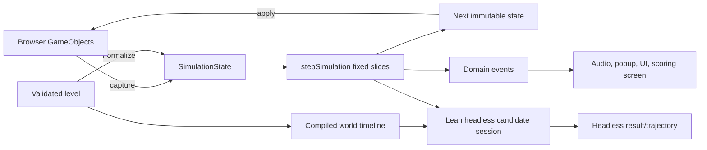

## 7. State models

### Game state

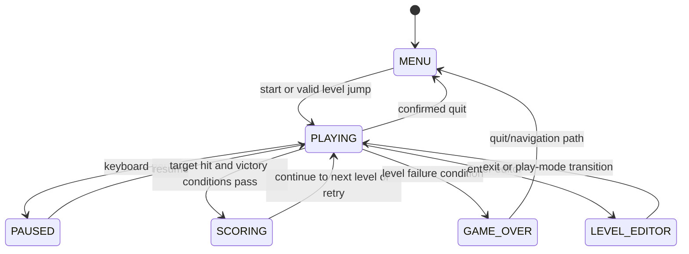

`Game.setState` remains the preferred transition operation for state-related effects. Input contexts inspect live state for every event, so direct state changes do not require listener reconciliation on a later frame.

The end screen derives its terminal branch from the configured maximum selectable level. All 25 default-catalog levels are shipped JSON definitions, and completion of level 25 enters `GAME_OVER`. The archived `manual` catalog contains 20 levels and remains within that catalog when advancing.

### Penguin state

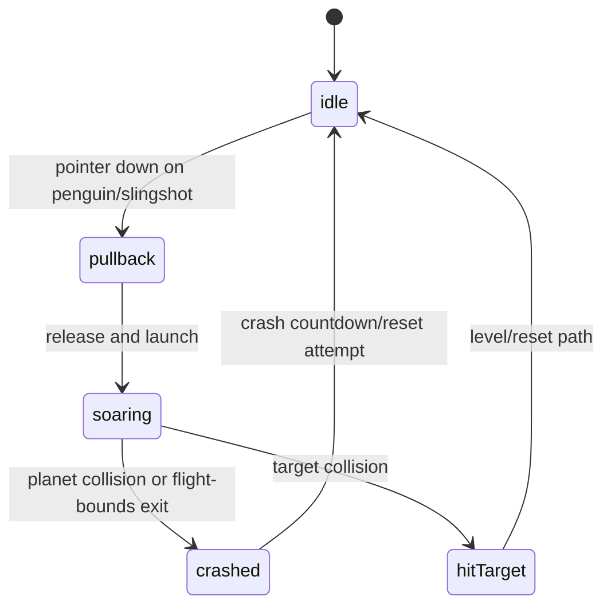

Comments retain a historical `snapping`/`scoring` vocabulary, but the current primary flow launches from pullback to soaring and game-level scoring is represented by `GameState.SCORING`.

### Attempt and scoring semantics

- `tries` counts launch attempts and is reset for a new level.
- `distance` accumulates travel and participates in the original-style `floor(distance * level / tries)` level score.
- `currentAttemptScore` holds collected bonus value for the current attempt; reset paths determine whether bonuses and score are retained.
- On completion, the level score and current attempt bonuses produce that level's contribution; retries replace the contribution only when the new result is higher. A non-default level multiplier is applied while calculating the candidate total.
- The high score is updated and saved after final score calculation.

## 8. Level ingestion and object graph construction

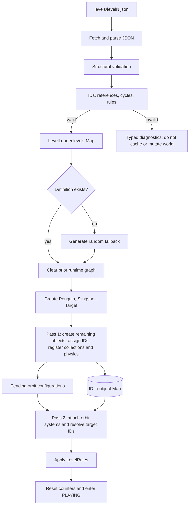

Validation is a precondition to mutation. `levelValidation.js` is a pure boundary shared by browser and Node loading; it accumulates stable `{ severity, code, path, message }` diagnostics. `levelSchema.js` owns the shared object/orbit vocabulary, aliases, and lookup capabilities. The loader validates fetched JSON before caching and revalidates a selected definition before the current world is cleared.

The two-pass construction design remains an important invariant. Object-referenced planet/bonus orbits can point forward to entities declared later in the JSON. Each referenced object must have a unique stable `properties.id`; duplicates, missing targets, self-references, and cycles are rejected before construction. The shared simulation advances planet, bonus, and target orbit sources. Only planets and bonuses may act as `orbitTargetId` centers, while active slingshot, text, and pointing-arrow orbits are rejected because those entities are not part of simulation stepping.

### Canonical top-level contract

```json
{
  "name": "Level Name",
  "description": "Optional description",
  "startPosition": { "x": 100, "y": 300 },
  "targetPosition": { "x": 700, "y": 300 },
  "objects": [],
  "rules": {}
}
```

The loader accepts object coordinates at `position`, or as fallback `properties.x` and `properties.y`. Prefer top-level `position` for human-authored definitions and treat editor-exported extra properties as implementation detail.

### Saved-level discovery contract

The level browser does not read storage directly. `LevelCatalogService` routes each request to a source implementing three asynchronous operations:

- `query({ text, cursor, pageSize, signal })` returns lightweight summaries, an opaque `nextCursor`, and an optional total.
- `getDetails(id, { signal })` returns richer display metadata without the playable definition.
- `getDefinition(id, { signal })` returns the level JSON only when Play or Edit is selected.

Summaries carry `{ id, source, name, description, thumbnail, author, tags, capabilities, createdAt, updatedAt }`. Source and ID form the stable catalog reference. The current local adapter searches name, description, author, and tags and uses offset cursors internally; callers must not interpret cursor values. A future HTTP source can use server-issued cursors without changing the screen.

Search resets the result set and cancels the prior request. Pagination appends one bounded page, while images use native lazy loading. Detail and definition requests are also cancellable. Play/Edit fetches and validates a definition before closing the browser or exiting an active editor session, so network or validation failures leave recovery controls visible.

### Supported object types

| JSON type | Runtime type | Core properties | Notes |
|---|---|---|---|
| `planet` | `Planet` | `id`, `name`, `radius`, `mass`, `gravitationalReach`, `planetType`, `orbit` | Registered in both `game.planets` and `Physics`. Reach values omitted or exported as zero normalize to the legacy default `5000`; use zero mass for no gravity. |
| `bonus` | `Bonus` | `id`, `name`, `value`, `orbit` | Registered in both `game.bonuses` and `Physics`. |
| `target` | `Target` | `id`, `name`, `width`, `height`, `spriteType`, `orbit` | First target definition becomes the singleton goal; otherwise `targetPosition` creates a default. |
| `slingshot` | `Slingshot` | `name`, `anchorX`, `anchorY`, `stretchLimit`, `velocityMultiplier` | First definition becomes the singleton launcher; otherwise `startPosition` creates a default. |
| `text`, `textobject` | `TextObject` | content, sizing, font/color, visibility/fade, render order | Supports a deliberately small HTML-like formatting parser, not arbitrary DOM HTML rendering. |
| `arrow`, `pointingarrow` | `PointingArrow` | colors, sizing, pulse, render order, `pointingAt`, `pointAfterDelay` | `pointAfterDelay` hides the arrow until it begins pointing at the configured `pointingAt` target. |
| `portal` | `Portal` | `id`, `pairedPortalId`, `color`, width, height, rotation, `playSound` | Red/blue endpoints must pair reciprocally. Swept teleportation is deterministic; clipped dual-penguin visuals and audio are browser effects. |
| `penguin` | none | exported state only | Accepted for compatibility with older editor exports; runtime creates the singleton penguin from `startPosition`. |

### Orbit contract

Editor-exported fields are canonical for current levels:

```json
{
  "orbit": {
    "orbitCenter": { "x": 400, "y": 300 },
    "orbitTargetId": null,
    "orbitRadius": 120,
    "orbitSpeed": 1,
    "orbitAngle": 0,
    "orbitType": "circular",
    "orbitParams": {}
  }
}
```

The loader also accepts aliases `center`, `targetId`, `radius`, `speed`, `angle`, `type`, and `params`.

| Orbit type | Required/meaningful fields | Behavior |
|---|---|---|
| `circular` | center or target ID, radius, speed, angle | Parametric circular motion. |
| `elliptical` | center/target, speed; `orbitParams.semiMajorAxis`, `semiMinorAxis`, `rotation` | Defaults axes from radius if omitted. |
| `figure8` | center/target, speed; `orbitParams.size` | Lemniscate-like motion. |
| `gravity` | center/target; `orbitParams.initialVelocity`, `gravityStrength` | Numerically integrates an orbiting object's position. |
| `custom` | programmatic functions only | JSON functions are not supported; JSON configuration falls back to circular. |

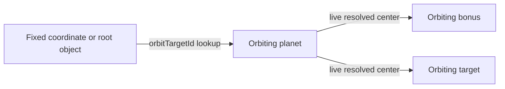

Validation explicitly rejects duplicate IDs, missing or unavailable references, self-references, and reference cycles. The simulation graph also resolves a parent before its children, making results independent of declaration order.

### Level rules

| Rule | Current behavior | Caveat |
|---|---|---|
| `maxTries` | Limits launched attempts; a final allowed shot reaches an outcome before failure is emitted. | Must be a positive integer when configured. |
| `requiredBonuses` | Blocks target victory until enough bonuses have been collected. | Zero is valid and means no bonus requirement. |
| `allowedMisses` | Fails once planet collisions exceed the tolerated count. | Zero is valid and means the first collision fails. |
| `gravitationalConstant` | Replaces the physics constant for that level. | Default is `3.0`; zero is valid and disables penguin gravity. |
| `scoreMultiplier` | Multiplies accumulated score after level completion. | Default `1.0`; applied to total score rather than only the current level. |
| `timeLimit` | Parsed, retained, and exported. | Not enforced by the current game loop. |
| `customBehaviors` | Parsed and retained by `LevelRules`. | No runtime dispatcher consumes it, and editor export currently omits it. |

## 9. Assets and audio

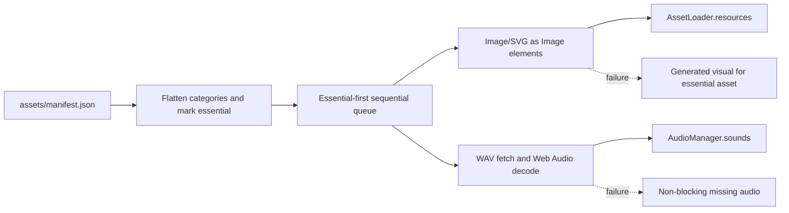

Manifest resource keys are normalized by category: `planet_<name>`, `sprite_<name>`, `ui_<name>`, and `audio_<name>`; animation names remain unchanged. Entity constructors receive the shared loader and may choose real sprites or programmatic fallbacks.

Operational constraints:

- Asset URLs are relative to the application root and therefore assume the repository directory layout.
- The startup loader currently attempts all assets, sequentially. `essential` controls priority and fallback generation, not a split between eager and lazy loading.
- `loadAssetOnDemand` exists, but its cache value shapes differ from eager loading for some media. Consumers should use typed getters unless that contract is normalized.
- Penguin animation metadata JSON is fetched separately when animations are constructed; it is not listed in the manifest.
- Web Audio may start suspended until a user gesture. Initialization failure turns sound off while allowing the game to continue.

## 10. Input, UI, and responsive boundaries

The logical display surface is always 800 x 600. The canvas backing buffer follows the viewport and device pixel ratio, then a centered contain transform preserves that display. A second, presentation-only world-camera transform maps level coordinates into the display. Levels without camera metadata use the identity transform and preserve legacy framing; expanded levels either fit their complete stage or use a smoothly following view clamped inside it. Pointer conversion applies both inverse transforms. Deterministic simulation and headless tools consume world coordinates and level bounds but never camera state.

Input action activation:

| Context | Ownership policy |
|---|---|
| Global | Browser-safe global shortcuts; higher than application modes. |
| Modal / console / editable target | Claims its event domain without requiring a mapped command; native defaults remain available unless explicitly prevented. |
| Editor edit mode | Claims editor keyboard and pointer input, including unmapped keys. |
| Gameplay / editor play mode | Claims gameplay keyboard, mouse, and touch input. |
| Paused / menu | Claims state-specific keyboard and menu pointer input. |

The code contains compatibility input methods on `Game`, but listener ownership belongs to `InputManager`. New input modes should provide a context with an ID, priority, declared input types, activation predicate, and handler. Long-lived modes stay registered; ephemeral UI may register on open and use the returned unregister closure on close.

UI is hybrid:

- The persistent HUD and controls are DOM elements in `index.html`.
- Gameplay, entities, traces, and most visual feedback are Canvas 2D.
- Modal game screens use the Canvas-based `UIManager` stack.
- The level editor creates DOM panels/toolbars and draws Canvas guides.
- Mobile controls and fullscreen controls are created dynamically.

## 11. Level editor architecture

The editor is an embedded mode over the live `Game` aggregate, not an offline document editor. `LevelEditor` coordinates focused views/controllers from `js/levelEditor/` for the inspector, object list, toolbar, pointer input, and Canvas overlay. `LiveLevelMutator` keeps runtime, typed, singleton, and physics collections synchronized. Reversible changes implement the typed `LiveEditCommand` contract from `js/editorCommands/`; `CommandRegistry` resolves strategies by type and `CommandHistory` invokes their `do()` and `undo()` methods against the same live objects. Repeated input events from one focused property-edit session coalesce into a single history entry.

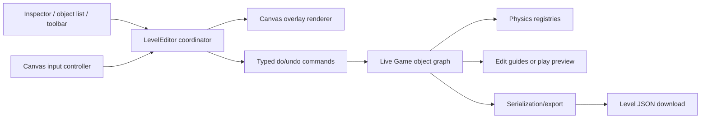

Architectural consequences:

- Edit and play previews share object identity and state, so reset logic matters when switching modes.
- Object membership is denormalized across `gameObjects`, typed arrays, singleton references, and physics registries. Add/remove operations must update all applicable stores.
- Stable IDs are part of the data model because orbit relationships serialize by ID.
- The editor exposes both comprehensive game export and its own serialization helpers; format changes must be reconciled across `Game`, `LevelEditor`, and `LevelLoader`.
- Export and Ctrl+S download canonical level JSON. In-session undo/redo covers structural edits, canvas moves, orbit-center moves, object properties, and level settings; server persistence is not implemented.

## 12. Persistence and network behavior

Current persistence is intentionally small:

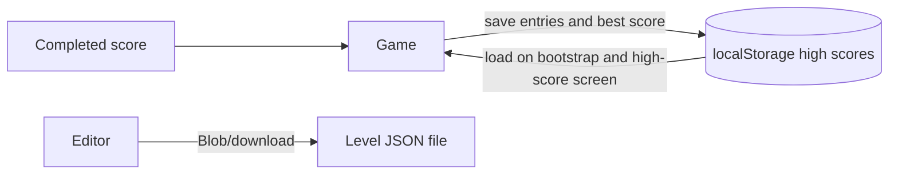

The HTML5 rewrite does **not** call the original Big Idea Fun leaderboard or submit scores over the network. It does persist local high-score entries (up to 100 saved entries, with top-ten all-time and today views); it does not persist level progress or settings. Historical network behavior appears only in the original documentation and `OldSource/`.

## 13. Design decisions and trade-offs

### Static, dependency-free browser application

**Why:** Minimal hosting, immediate browser execution, low dependency risk, and easy inspection against decompiled source.

**Trade-off:** No build-time type checking, tree shaking, asset hashing, or dependency-based test framework. Level definitions do have dependency-free runtime/CLI validation.

### Fixed stage with display-resolution rendering

**Why:** Matches the original 800 x 600 composition and makes legacy coordinates portable.

**Trade-off:** The complete authored stage is preserved, so non-4:3 displays have gutters; DOM/editor overlays require shared coordinate conversion.

### Central `Game` aggregate

**Why:** Makes original global/stateful game logic straightforward to port and gives the editor one live graph to manipulate.

**Trade-off:** `Game` has many reasons to change and knows about rendering, physics, input-facing methods, UI, editor, persistence, and scoring.

### Data-driven levels with a factory

**Why:** Levels can be authored and loaded without per-level code. Factory aliases preserve compatibility with older and editor-generated formats.

**Trade-off:** The executable validator is the authoritative contract, but there is not yet a generated/formal JSON Schema for editor tooling and IDE completion.

### Two-pass orbit resolution

**Why:** Supports hierarchical and forward object references independent of declaration order.

**Trade-off:** IDs form a relational schema that requires coordinated validation and construction passes; current object-target lookup is intentionally limited to planets and bonuses.

### Fidelity-oriented physics

**Why:** Constants, state names, scoring, traces, crash timing, and reference assets are intended to preserve the Shockwave feel.

**Trade-off:** Snapshot/adaptation adds small per-frame allocations, but gameplay behavior is deterministic, testable without the DOM, and shared exactly by browser and headless runners.

### Graceful media degradation

**Why:** Missing media should not prevent gameplay.

**Trade-off:** Startup can report completion with failed resources, so automated smoke tests or log monitoring are needed to catch packaging errors.

## 14. Architectural invariants

Maintain these constraints when changing the system:

1. Level, collision, and editor coordinates are world coordinates independent of CSS display size; the presentation surface remains 800 x 600 and legacy levels use its identity camera.
2. Use the single `AssetLoader`/`AudioManager` graph created at bootstrap; do not create per-entity audio contexts.
3. Add/remove entities through operations that update `gameObjects`, the correct typed collection, physics registration, singleton references, and render-cache invalidation.
4. Keep `Penguin.x`, `Penguin.y`, and `Penguin.position` synchronized until the representation is consolidated.
5. Assign unique stable IDs to every object used as an orbit target; keep orbit-reference graphs acyclic.
6. Apply object-referenced orbits only after all referenced objects have been created.
7. Transition game state through `setState` where possible so input listeners reconcile immediately.
8. New level fields need coordinated changes in loader defaults, editor property UI, serializer/export, examples, and tests.
9. Asset keys must match loader normalization and consumer lookup names.
10. A failed optional asset must not prevent bootstrap; an invalid structural level should fail validation rather than silently create a misleading partial level.
11. Gameplay movement and outcomes must enter through `stepSimulation`; rendering objects and adapters may apply state/effects but must not independently advance orbit or flight physics.
12. Simulation transitions must remain deterministic, dependency-free from DOM/audio/timers, and run on exact 1/60-second ticks regardless of display refresh rate. The browser-facing `stepSimulation` contract is immutable; mutable entry points are restricted to isolated sessions that own their state.

## 15. Extension playbooks

### Add a runtime entity type

1. Implement or extend an entity in `gameObjects.js` with `update(delta)` and `draw(ctx)` behavior.
2. Export it and add a `GameObjectFactory.create` branch.
3. Define JSON defaults and validation expectations.
4. Register it in the appropriate `Game` collections and subsystem registries during load.
5. Add constructor/default/property/serialization support in `LevelEditor` and `Game` export.
6. Add assets to the manifest if required, with programmatic fallback where appropriate.
7. Add a focused browser harness and a production-level integration test.
8. Update this document and `levels/README.md`.

### Add a level rule

1. Add it to validated/normalized `SimulationState.rules` without using truthiness when zero/false is meaningful.
2. Evaluate it in `simulationEngine.js` at the defined transition boundary and emit a domain event when effects are needed.
3. Handle the effect in `GameSimulationAdapter`; keep DOM/audio out of the core.
4. Reset associated counters through simulation-state reset operations.
5. Export it from `Game.exportLevelRules`, expose it in the editor if authorable, and test browser/headless parity.

### Add an orbit type

1. Add the shared type vocabulary in `levelSchema.js` and pure math in `orbitSimulation.js`.
2. Add factory configuration in `GameObjectFactory.configureOrbitSystem` and state capture/normalization.
3. Add editor fields, guide rendering, serialization, and clone support.
4. Define fixed-center and object-target behavior.
5. Test missing targets, hierarchy, declaration-order independence, 30/60 Hz parity, negative speed, resets, and cycles.

### Add an asset

1. Place it under the appropriate `assets/` category.
2. Add the manifest mapping and, if bootstrap-critical, the normalized key to `essential`.
3. Retrieve it through the category getter or define a stable typed getter.
4. Verify success and missing-file fallback paths from an HTTP server.

## 16. Testing and quality architecture

There are three current test surfaces:

1. `testing/manual/` contains indexed manual browser harnesses for audio, bonus behavior, gravity/orbits, input, level transitions, mobile/responsive behavior, and editor scenarios. They are useful diagnostics but have no shared runner or assertions.
2. `testing/` contains dependency-free Node regression suites plus a headless runner, shared level validation, and trajectory search CLI. Browser and headless paths consume the same simulation transition kernel, orbit graph, collision/bonus/target/rule outcomes, launch math, reset contract, and scoring functions. Headless sweeps reuse an exact compiled world timeline, suppress movement-only events, and can partition large candidate grids across a bounded worker pool. The CLI can render successful routes as terminal ASCII maps.
3. `e2e/` contains Playwright smoke tests against a dependency-free local static server. They exercise production bootstrap, canvas input and rendering, pause/resume, scoring transition, failed-audio degradation, responsive coordinate mapping, and editor download/export. Network substitution supplies a deterministic level while leaving the production runtime path intact.

The `.github/workflows/ci.yml` workflow runs Node tests, configuration policy checks, shipped-level validation, syntax checks, and Chromium smoke tests. Failed browser runs retain traces, screenshots, videos, and an HTML report.

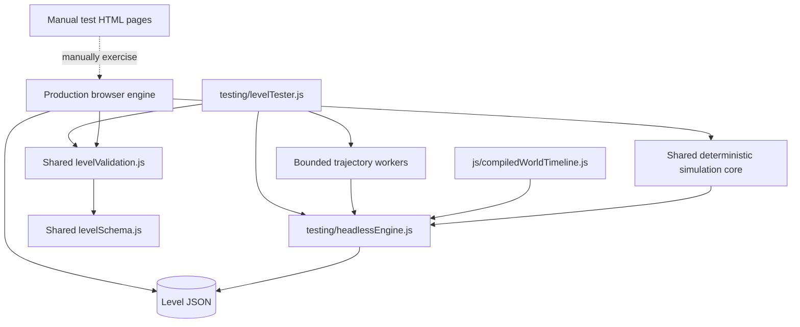

Verified limitations as of 2026-08-15:

- The headless runner shares deterministic gameplay semantics. It intentionally does not model browser-only rendering, sprite animation, audio, popup timing, DOM input, or asynchronous scoring-screen timing.
- Worker count is capped at four. `auto` remains single-threaded below 5,000 candidates to avoid paying worker startup and duplicate-timeline costs on small sweeps.
- There is executable structural/semantic level validation but no generated JSON Schema artifact, linting, or coverage reporting. Node regression tests use the built-in `node:test` runner; browser coverage uses Playwright with Chromium.

Recommended quality direction, in order:

1. Generate a JSON Schema from the shared contract for editor tooling and IDE completion.
2. Add recorded golden trajectories for representative shipped levels and protect intentional balance changes with fixture review.
3. Extend deterministic tests to multi-bounce crash sequences and terminal level transitions.
4. Expand browser coverage to failure recovery, fullscreen behavior, and cross-browser compatibility where those risks justify the added runtime.
5. Add linting and coverage thresholds after establishing a maintainable baseline.

## 17. Risks and architectural debt

| Priority | Risk/debt | Impact | Suggested treatment |
|---|---|---|---|
| Medium | `Game` is a large coordinator and mutable data store. | High change coupling and difficult isolated tests. | Gradually separate session/level state, simulation, rendering, and persistence behind explicit interfaces. |
| Medium | Globals and circular module relationships (`Game`/loader/end screen/editor). | Initialization sensitivity and limited reuse. | Introduce a composition root/context and dependency inversion for transitions. |
| Medium | Level rules advertise unimplemented `timeLimit` and `customBehaviors`. | Authoring expectations differ from runtime. | Implement or reject them explicitly during validation. |
| Medium | Manifest-fetch failure does not call the asset completion callback; individual media failures do. | A missing/invalid manifest can leave bootstrap stuck while other packaging errors degrade silently. | Model bootstrap failure explicitly and surface a terminal retry/error UI. |
| Medium | Asset eager/on-demand cache shapes are inconsistent. | Consumers can receive wrappers, images, or SVG text under similar keys. | Define a single resource record contract. |

## 18. Remaining larger work

These items are intentionally separate from the completed low-risk cleanup. They affect public behavior, ownership boundaries, or authoring contracts and should be handled as small, test-backed migrations rather than broad rewrites.

### 18.1 Split the `Game` aggregate

**Current state.** `js/game.js` is both the runtime aggregate and the main coordinator. It owns level and attempt counters, score persistence, entity collections, physics registration, simulation adaptation, rendering, input-facing compatibility methods, UI transitions, editor entry points, fullscreen callbacks, and export logic. The deterministic simulation boundary reduces gameplay coupling, but most browser-side state still converges on `Game`.

**Why it matters.** A change to level loading, rendering, scoring, editor behavior, or input can require knowledge of unrelated state. Tests therefore need increasingly large fixtures, and it is easy for two subsystems to mutate the same collection or counter with different assumptions. The existing `_gameObjectsChanged` cache flag and parallel collections (`gameObjects`, `planets`, `bonuses`, singleton references, and physics registries) are symptoms of this coordination load.

**Target shape.** Move toward explicit browser-side boundaries:

| Boundary | Owns | Must not own |
|---|---|---|
| `GameSession` or session state module | Level number, attempts, score, high score, level metadata, state transitions | Canvas drawing, DOM listeners, entity construction |
| Runtime world/context | Entity collections, singleton lookup, add/remove registration, render-cache invalidation | Score policy and browser persistence |
| Renderer | Canvas transforms, draw ordering, trails, starfield, visual snapshots | Simulation mutation, level loading, input decisions |
| Effects/UI coordinator | Audio, popups, end screen, messages, browser-only feedback | Authoritative gameplay state |
| `Game` facade | Composition and compatibility delegation | New domain policy that belongs in one of the boundaries above |

**Migration path.** First extract session transitions and scoring behind a narrow interface while leaving `Game` as the facade. Next introduce a runtime-world API and route every entity mutation through it. Then make rendering consume a read-only snapshot and move visual caches out of the aggregate. Finally move editor/export and browser effects to injected collaborators. Each step should preserve the current `Game` public methods until callers migrate.

**Completion criteria.** Level loading, one simulation frame, rendering, score calculation, and editor mutation can each be tested with focused fixtures. `Game` remains a thin composition layer, and no subsystem needs to know the storage layout of another subsystem's collections.

### 18.2 Remove module cycles and implicit global dependencies

**Current state.** `GameState` now has a dependency-light home in `gameState.js`, and input policy contexts import it there rather than pulling in the `Game` aggregate. Some older modules still import the compatibility re-export from `game.js`. Browser-only collaborators also reach through `window.game` or `window.gameManager` for coordination.

**Why it matters.** Importing a seemingly small module can initialize a large portion of the browser runtime. Construction order becomes significant, Node tests need shims, and dependencies are hidden in global lookups rather than visible in constructors. This makes reuse of the loader, end screen, and editor harder than their APIs suggest.

**Target shape.** Move state vocabulary into a dependency-free `gameState.js` module. Create an explicit composition context from `main.js` containing the game facade, input manager, asset/audio services, and browser callbacks. Pass required collaborators into constructors instead of resolving them from `window`; retain `window.game` and `window.gameManager` only as compatibility/public debugging handles.

**Migration path.** Extract `GameState` first and update imports without changing behavior. Add context parameters with defaults only at the composition root. Replace each `window` lookup with an injected callback or service, then remove the fallback once all production callers use the context. Use import-graph checks or a small dependency test to prevent new cycles.

**Completion criteria.** Core level loading, validation, simulation adaptation, and UI construction can be imported in a browser-free test without installing unrelated globals. The composition root is the only place that assembles concrete browser services.

### 18.3 Decide and implement the level-rule contract

**Current state.** `LevelRules` parses and retains `timeLimit` and `customBehaviors`; the schema and export paths partially acknowledge them. The simulation state has no elapsed-time rule event, and no runtime dispatcher consumes custom behaviors. This means a level can appear to author these features successfully while the game silently ignores them.

**Decision required.** Each rule needs one of two explicit outcomes:

- **Implemented rule:** define its normalized type, state inputs, deterministic simulation event, browser effect, headless behavior, editor exposure, and export round-trip.
- **Rejected rule:** validate it as unsupported with a machine-readable diagnostic and remove it from normalized/exported output where appropriate.

**Recommended implementation boundary.** A `timeLimit` can be implemented safely in the deterministic core as elapsed simulation time plus a `RULE_FAILURE` event. It must use fixed simulation time rather than wall-clock time so browser and headless outcomes match. `customBehaviors` should not execute arbitrary code from JSON; if retained, it should become a registry of named, versioned behaviors with serializable parameters and explicit handlers.

**Completion criteria.** Every accepted rule is represented in the shared schema, normalized definition, simulation state or rules evaluator, browser adapter, headless runner, editor export, and tests. Invalid or unsupported rules fail validation instead of becoming no-ops.

### 18.4 Normalize asset loading and bootstrap failure behavior

**Current state.** `AssetLoader` supports manifest loading, eager loading, on-demand loading, generated visual fallbacks, and optional media degradation. The manifest failure path can leave bootstrap without the normal completion signal, and cached values differ by resource path: callers may receive an image, SVG text, audio object, or wrapper depending on how the resource was loaded.

**Why it matters.** Consumers must know which loading path produced a resource, and bootstrap can become stuck on a packaging/configuration failure. This is especially difficult to diagnose in static hosting, where a missing manifest and a missing optional sound have very different consequences.

**Target shape.** Define one internal resource record, for example `{ status, kind, value, source, error }`, and make eager and on-demand loading converge on it. Separate required bootstrap failure from optional asset failure. The bootstrap coordinator should receive a resolved success/failure result exactly once and show a retryable error state for a missing or invalid manifest.

**Migration path.** Inventory current consumers and normalize the loader behind a compatibility accessor. Add tests for manifest rejection, malformed manifest data, required visual fallback, optional audio failure, and repeated on-demand requests. Migrate callers to inspect the record rather than the concrete resource wrapper, then remove shape-specific branches.

### 18.5 Retire internal legacy compatibility layers deliberately

**Current state.** Some compatibility is part of the level contract and should remain: object-type aliases, exported `penguin` definitions, zero gravitational-reach normalization, and `globalConstants.js` views. Other compatibility is internal and appears to have no current production caller, including the deprecated `Game.setupEventListeners()` and `UIManager.setupEventListeners()` paths. `Physics` also retains registry, trace, and helper APIs even though the shared simulation engine is authoritative for gameplay movement.

**Why it matters.** Compatibility code is useful only when its supported caller and removal condition are known. Otherwise it preserves duplicate behavior, increases the surface area for new features, and makes it unclear which path is authoritative.

**Migration path.** Classify each compatibility method as external contract, editor/file-format contract, or internal shim. Add a comment or documentation reference for the first two categories. For internal shims, record repository callers, route any remaining caller to the authoritative path, add a deprecation warning only where useful, and remove the shim in a separate change. Do not remove file-format compatibility without a migration path for existing level JSON.

**Completion criteria.** Every retained compatibility surface has a named reason and test coverage. Internal wrappers no longer contain independent gameplay behavior, and the authoritative simulation/adapter path is obvious from the component model.

### 18.6 Establish lint, coverage, schema, and golden-behavior gates

**Current state.** The project has strong regression and browser smoke coverage, but no configured linting, coverage threshold, generated JSON Schema, or recorded golden trajectories. Syntax checks catch parse failures but not unused locals, unreachable branches, inconsistent naming, or accidental API drift.

**Recommended sequence.**

1. Add a minimal ESLint configuration focused on `no-unused-vars`, unreachable code, accidental globals, consistent errors, and browser/Node environment boundaries. Record intentional compatibility exceptions explicitly.
2. Add coverage reporting with a modest baseline threshold, then raise thresholds only after unstable or browser-only areas are separated from deterministic core code.
3. Generate a JSON Schema or equivalent editor contract from the shared level vocabulary and validate representative exported files in CI.
4. Record golden trajectories for a small set of shipped levels, including success, bonus requirements, collision recovery, and terminal-level transitions. Review fixture changes as gameplay-balance changes.

**Completion criteria.** CI reports actionable static-analysis and coverage failures, level tooling can consume the same contract as runtime validation, and intentional simulation changes require an explicit fixture update.

### 18.7 Suggested sequencing

The safest order is to establish observability before moving ownership:

| Phase | Work | Reason |
|---|---|---|
| 1. Guardrails | Lint baseline, focused coverage, golden trajectories, terminal-transition tests | Makes later structural changes measurable and protects gameplay fidelity. |
| 2. Contracts | Extract `GameState`, formalize level-rule decisions, normalize resource records | Removes ambiguity before moving code between modules. |
| 3. Boundaries | Introduce composition context, runtime-world API, and persistence/effects interfaces | Reduces hidden coupling while keeping `Game` as a compatibility facade. |
| 4. Extraction | Split session, renderer, effects, and editor coordination from `Game` | Lowers change coupling after the seams are exercised. |
| 5. Retirement | Remove internal compatibility shims and stale fallback branches | Avoids deleting compatibility before its callers and contracts are understood. |

## 19. Modernization seams

The safest incremental boundaries are:

- **Composition root:** keep construction and browser globals in `main.js`, passing an explicit context to subsystems.
- **Deterministic simulation boundary:** established across geometry, gravity, orbit graph, state, engine, and browser adapter modules; preserve its browser-free transition contract as features are added.
- **Validated level model:** parse raw JSON into a normalized in-memory level before mutating `Game`.
- **Runtime world API:** encapsulate entity add/remove/query so typed arrays, physics registration, singleton references, and render cache cannot diverge.
- **Persistence adapter:** hide `localStorage` and file download behind small interfaces.
- **Renderer boundary:** pass a read-only world snapshot into rendering instead of allowing visual objects to own broad runtime access.

These seams support better tests and eventual TypeScript or framework adoption without requiring a rewrite of game behavior.

## 20. Repository and documentation map

| Path | Purpose | Authority |
|---|---|---|
| `ARCHITECTURE.md` | Current system design, contracts, flows, decisions, and debt | Primary architecture reference |
| `README.md` | Project entry point, run instructions, capabilities, document links | Current overview |
| `levels/README.md` | Current level authoring contract | Level-authoring reference |
| `LEVEL_EDITOR_DOCUMENTATION.md` | Detailed editor usage | Editor user guide; verify against editor code when changing behavior |
| `AUDIO_SYSTEM_IMPLEMENTATION.md` | Audio implementation notes | Focused implementation history |
| `BONUS_SYSTEM_IMPLEMENTATION.md` | Bonus implementation notes | Focused implementation history |
| `ORIGINAL_LEVELS_ANALYSIS.md` | Analysis of original levels | Historical/research reference |
| `SpacedPenguin_Documentation.md` | Original Shockwave behavior and porting provenance | Historical, not current runtime architecture |
| `OldSource/` | Decompiled Director/Lingo and extracted assets | Reference only; excluded from deployment |

## 21. Architect verification checklist

Before accepting a cross-cutting change, verify:

- Does it preserve the 800 x 600 logical display contract and camera-aware world-coordinate conversion across desktop, mobile, fullscreen, and editor input?
- Are bootstrap failures and optional-resource degradation explicit?
- Are game and penguin state transitions defined and input actions reconciled?
- Does every entity mutation keep all collections, physics, and render caches consistent?
- Does the level format round-trip loader → runtime/editor → export → loader?
- Are IDs unique and all orbit references resolvable and acyclic?
- Are attempt, level, total-score, and high-score reset boundaries correct?
- Is behavior tested through the shared production simulation seam and, where relevant, both its browser adapter and headless runner?
- Are new browser APIs compatible with static hosting and the no-build execution model?
- Were current docs updated separately from historical Shockwave provenance?
