# Spaced Penguin Architecture

**Status:** Current architecture reference

**Audience:** Software architects, maintainers, game/system developers, and level-tooling developers

**Last verified:** 2026-08-01 against the repository source

**Scope:** The browser-based HTML5 rewrite. `OldSource/` is reference material, not a runtime dependency.

## 1. Executive summary

Spaced Penguin is a client-only, static web game. The browser loads one HTML page and an ES-module graph; there is no build step, application server, database, or current network API beyond static-file `fetch` calls. The game uses an internally fixed 800 x 600 Canvas 2D coordinate system, scales its display for the viewport, loads a manifest of images and audio, loads 19 JSON level definitions, and then runs a `requestAnimationFrame` update/render loop.

The central `Game` object is both the runtime aggregate and the main coordinator. It owns gameplay state, entity collections, physics registration, scoring, UI overlays, the level editor, fullscreen support, and level transitions. `GameManager` owns browser lifecycle concerns: bootstrap, responsive display sizing, page visibility, the frame loop, and construction of the state-aware input router.

The architecture favors direct browser execution and fidelity to the original Shockwave game over framework abstraction. This keeps deployment and iteration simple, but concentrates responsibilities in `Game`, permits some global access through `window`, and leaves automated tests disconnected from the production engine.

## 2. System context

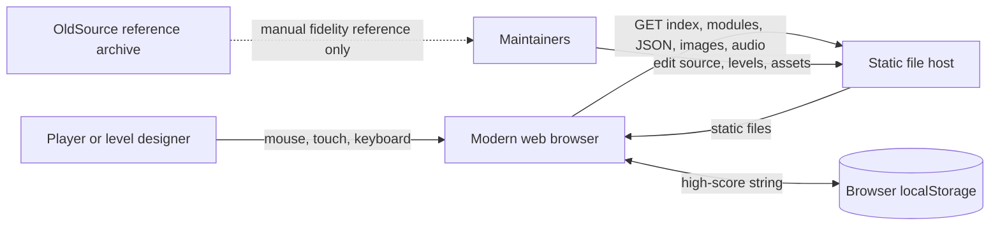

### External inputs

| Input | Format | Consumer | Notes |
|---|---|---|---|
| Player input | DOM mouse, touch, keyboard, click, resize, visibility events | `InputActionManager`, `Game`, `UIManager`, `FullscreenManager` | Input actions are activated by game/editor state. |
| Asset catalog | `assets/manifest.json` | `AssetLoader` | Resolves images, SVGs, sprite sheets, and WAV files. |
| Level definitions | `levels/level1.json` through `level19.json` | `LevelLoader` | Loaded at startup and held in an in-memory `Map`. |
| URL level selector | `?level=N` | `GameManager` / `Utils` | Current shipped range is 1–19, despite a stale 1–25 validation bound in `main.js`. |
| Prior high score | `localStorage.spacedPenguinHighScore` | `Game` | Only durable gameplay state in the current rewrite. |

### Outputs

| Output | Destination | Notes |
|---|---|---|
| Game and editor graphics | Canvas 2D plus DOM overlays | Canvas retains a logical resolution of 800 x 600. |
| Sound | Web Audio API destination | Decoded WAV buffers are played through per-sound gain nodes. |
| High score | Browser `localStorage` | No online leaderboard or remote score submission exists in the rewrite. |
| Exported level | Downloaded JSON | Export is client-side; editor save/undo/redo are not implemented. |
| Diagnostics | Browser console and in-game console/logger | `window.game`, `window.gameManager`, and `window.levelEditor` expose debugging entry points. |

## 3. Deployment and execution model

The deployable unit is the repository's static content. A compliant static server must preserve relative paths and serve JavaScript modules, JSON, images, SVG, and WAV files. Opening `index.html` directly from `file://` is not supported reliably because module and `fetch` security policies vary by browser.

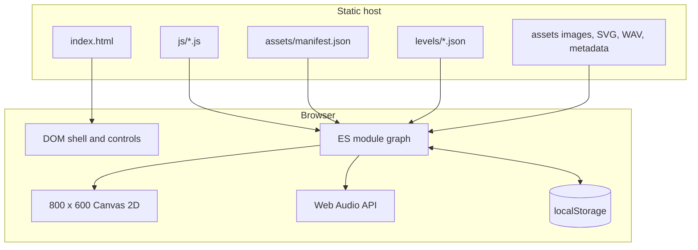

There is no bundler, transpiler, package dependency, service worker, backend, authentication, telemetry service, or CI configuration in the current repository. Browser support therefore depends directly on native ES modules, Canvas 2D, `fetch`, `Map`, optional chaining, Web Audio, Fullscreen, and related contemporary APIs.

## 4. Component model and ownership

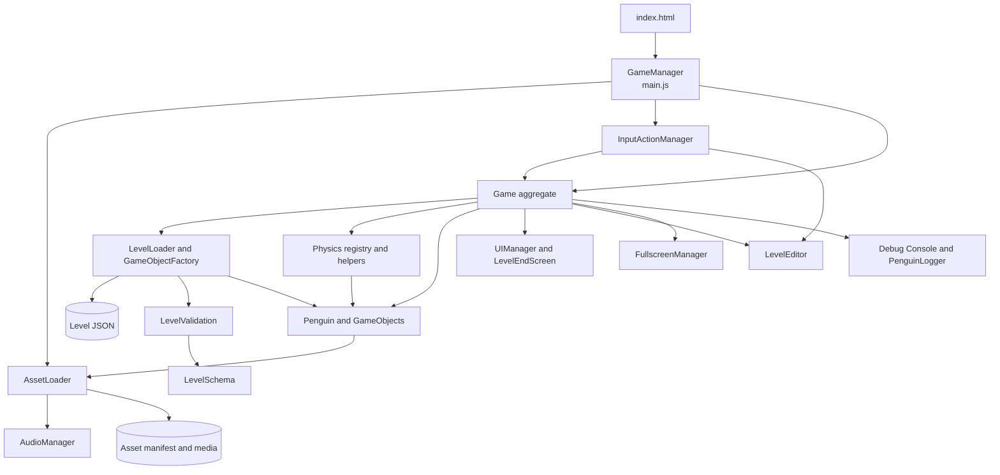

| Component | Primary responsibility | Important collaborators | Architectural notes |
|---|---|---|---|
| `index.html` | DOM shell, HUD, canvas, responsive CSS, module entry | `main.js` | Logical canvas size is declared here. |
| `GameManager` (`main.js`) | Browser bootstrap, frame scheduling, visibility handling, viewport scaling, start screen | `AssetLoader`, `Game`, `InputActionManager` | Owns the outer lifecycle; published as `window.gameManager`. |
| `Game` (`game.js`) | Runtime aggregate, state, level/attempt lifecycle, scoring, collision orchestration, render pipeline | Nearly all runtime components | Deliberately central, but is the main coupling hotspot. |
| `AssetLoader` | Manifest loading, ordered resource loading, caches, visual fallbacks | `AudioManager` | Loads all manifest assets sequentially; “essential” changes order and fallback behavior, not whether an asset loads. |
| `AudioManager` | Audio context, decode/cache, playback, volume | Web Audio API | Audio context construction/resume can be constrained by autoplay policy; failures disable audio without blocking graphics. |
| `InputActionManager` | Add/remove listeners according to state | `Game`, editor, DOM/window | Always enables keyboard, window, and UI actions; switches menu/gameplay/editor actions. |
| `LevelSchema` | Shared level-format vocabulary and runtime capability configuration | Validator, loader, editor | Owns canonical object/orbit types, aliases, normalization, and orbit lookup target types. |
| `LevelValidation` | Pure structural and semantic validation with typed diagnostics | `LevelSchema` | Has no DOM, game-object, fetch, or filesystem dependencies; shared by browser and Node loaders. |
| `LevelLoader` | Fetch/validate/cache level JSON and instantiate a level into `Game` | Validator, factory, rules, entities, physics | Rejects invalid content before caching/mutation and uses two-pass orbit resolution. |
| `GameObjectFactory` | Validated JSON-to-runtime entity mapping and orbit configuration | Entity constructors, `LevelSchema` | Supports canonical types plus configured text/arrow aliases; exported penguin state is intentionally ignored. |
| `Physics` | Registry of gravity bodies/bonuses, general force/collision/trace helpers | `Game`, entities | The live penguin path is orchestrated by `Game` and `Penguin`; not every generic helper is on the active path. |
| `Penguin` | Character state, position/velocity, gravity integration, crash behavior, sprite animation | `Game`, planets, assets | Maintains parallel `x`/`y` and `position` representations that must stay synchronized. |
| `GameObject` hierarchy | Entity update/draw, orbit behavior, collision/visual state | `Game`, assets, physics | Includes planet, bonus, target, slingshot, tutorial text/arrows, off-screen arrow, and popup. |
| `OrbitSystem` | Circular, elliptical, figure-8, gravity, or programmatic custom motion | Optional object-ID lookup | Centers may be fixed coordinates or live entity references. |
| `UIManager` | Stack of Canvas UI screens and input dispatch | `LevelEndScreen`, audio | Rendered above game entities and below the editor overlay. |
| `LevelEndScreen` | Animated score breakdown and continue/retry actions | `Game`, `UIManager` | Drives transitions out of `SCORING`. |
| `LevelEditor` | In-browser object creation, selection, property editing, play/edit mode, export | `Game`, entity classes | Mutates the live runtime graph directly; it is not a separate model. |
| `FullscreenManager` | Fullscreen DOM and scaling behavior | Canvas/container | Uses vendor-prefixed fallbacks in addition to the standard API. |
| `PenguinLogger` / `Console` | Themed logs and debug commands | DOM and global runtime handles | Operational diagnostics, not durable telemetry. |
| `PerformanceUtils` | Frame-time tracking and browser timing helpers | `GameManager` | The main loop records capped frame durations. |

## 5. Bootstrap and lifecycle

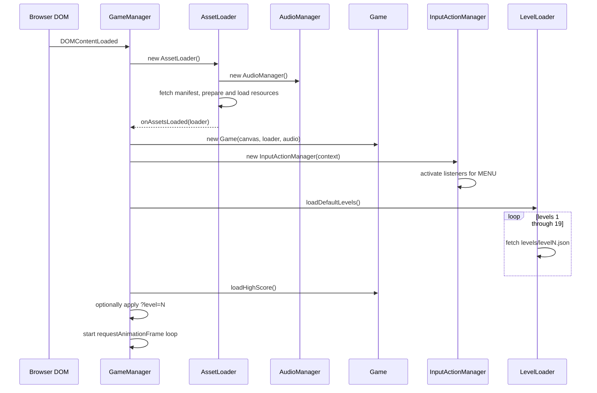

Important bootstrap properties:

- The manifest and every listed asset are attempted before `Game` is constructed. A failed essential visual receives a generated canvas fallback; failed nonessential media is logged and omitted.
- Level files are loaded serially. A missing or invalid level is absent from the cache and is generated procedurally when requested.
- `AssetLoader` constructs the actual `AudioManager`. Although `main.js` imports `AudioManager`, it obtains the shared instance from the loader.
- The recurring frame callback is scheduled before the loop checks `isRunning` and page visibility. Hidden pages skip work; the first frame after visibility resumes resets timing to avoid a large delta.
- Render delta is capped to 1/30 second and sub-1/120-second frames are skipped. Penguin gravity uses shared simulation code with 1/60-second maximum substeps, preserving the legacy 60 Hz calibration while producing the same 30 and 60 FPS result.
- `GameManager` owns a single cancellable animation-frame request. Visibility pause/resume is idempotent and does not start parallel frame chains.

## 6. Runtime update and render flow

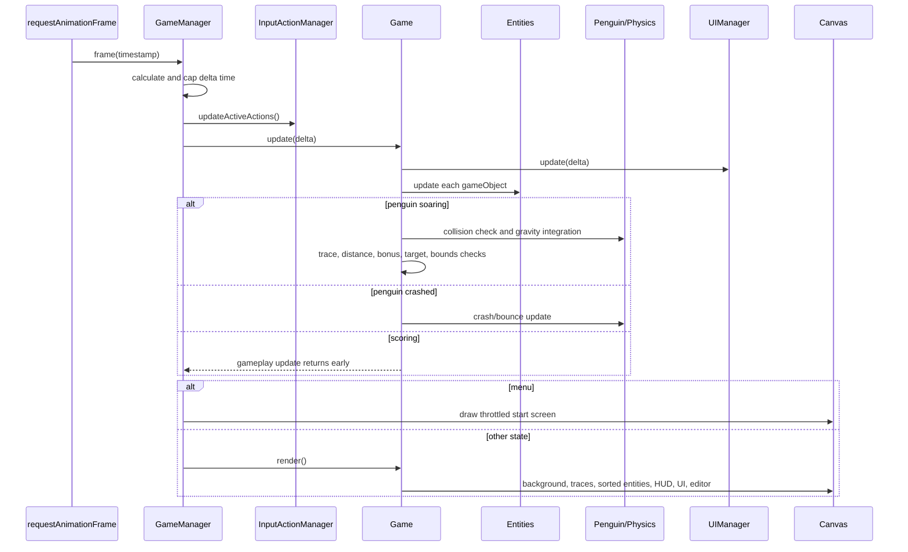

### Render order

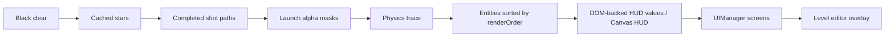

`Game` caches the render-order sort and invalidates it through `addGameObject`, `removeGameObject`, or explicit level-load invalidation. Code that mutates `gameObjects` directly must also set `_gameObjectsChanged`, or drawing order can remain stale.

### Live physics path

For a soaring penguin, the active flow is:

1. Convert current planets into lightweight position/mass/collision/reach records.
2. Check planet collision before applying gravity.
3. Delegate force integration to `Penguin.updateWithPlanetGravity` using the level's gravitational constant and frame delta.
4. Record shot path and derive traveled distance from trail points.
5. Query `Physics.checkBonusCollection`, then update attempt score and popup/audio for newly collected bonuses.
6. Check target collision and level victory requirements.
7. Check flight bounds and level failure requirements.

This division is historically evolved: `Physics` owns the registries and generic helpers, while `Game` and `Penguin` jointly implement the production flight path. Architects should not assume `Physics.updatePhysics()` is the single authoritative integration entry point.

## 7. State models

### Game state

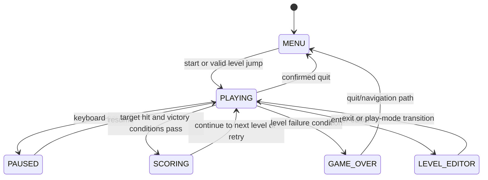

`Game.setState` is the preferred transition operation because it immediately refreshes active input listeners. A few loader, editor, and end-screen paths assign `game.state` directly; those paths rely on the next frame's `InputActionManager.updateActiveActions()` to reconcile listeners.

The end screen contains an intended final-level branch, but `LevelRules` never defines the `isLastLevel` flag it checks. Current continuation therefore advances beyond level 19 and uses generated fallback levels instead of reaching that final-level `GAME_OVER` path.

### Penguin state

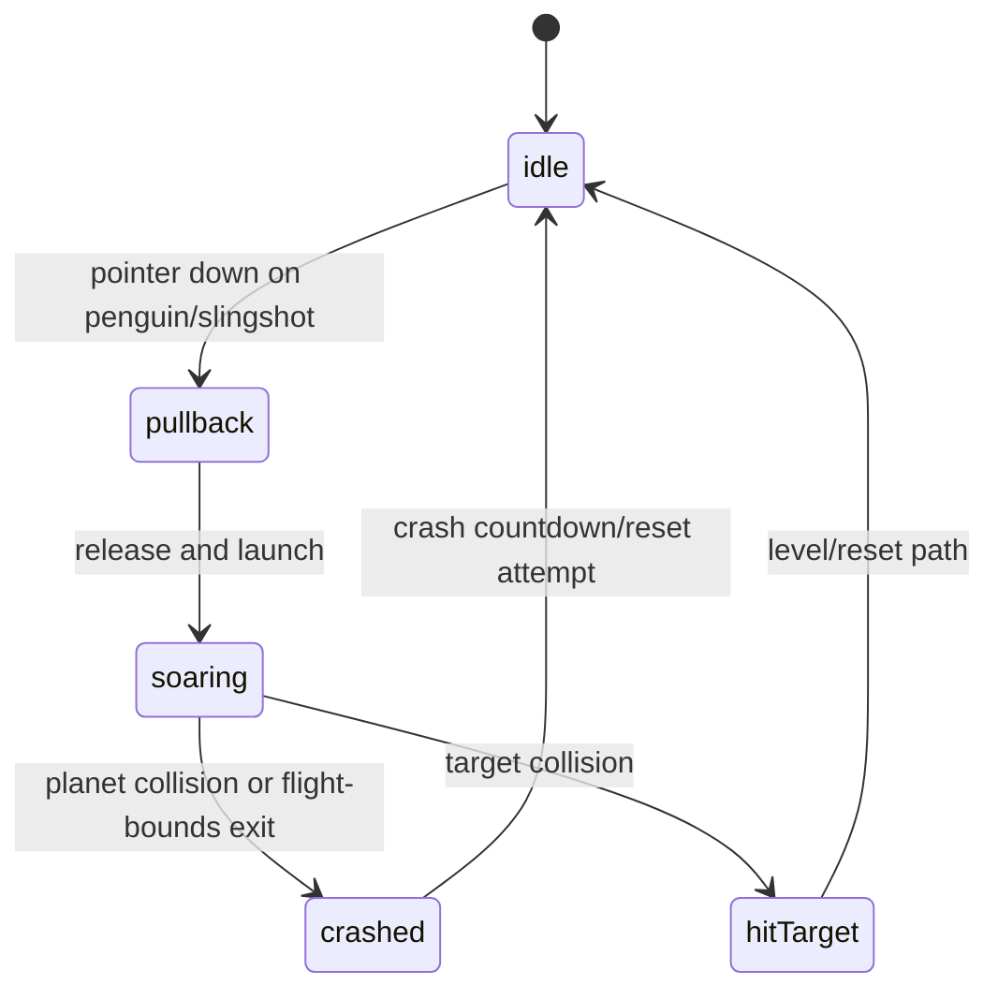

Comments retain a historical `snapping`/`scoring` vocabulary, but the current primary flow launches from pullback to soaring and game-level scoring is represented by `GameState.SCORING`.

### Attempt and scoring semantics

- `tries` counts launch attempts and is reset for a new level.
- `distance` accumulates travel and participates in the original-style `floor(distance * level / tries)` level score.
- `currentAttemptScore` holds collected bonus value for the current attempt; reset paths determine whether bonuses and score are retained.
- On completion, the level score and current attempt bonuses are added to total `score`; then a non-default level multiplier is applied to the total accumulated score.
- The high score is updated and saved after final score calculation.

## 8. Level ingestion and object graph construction

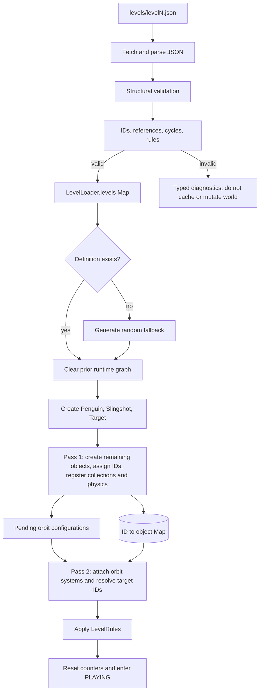

Validation is a precondition to mutation. `levelValidation.js` is a pure boundary shared by browser and Node loading; it accumulates stable `{ severity, code, path, message }` diagnostics. `levelSchema.js` owns the shared object/orbit vocabulary, aliases, and lookup capabilities. The loader validates fetched JSON before caching and revalidates a selected definition before the current world is cleared.

The two-pass construction design remains an important invariant. Object-referenced planet/bonus orbits can point forward to entities declared later in the JSON. Each orbitable object must have a unique stable `properties.id`; duplicates, missing targets, self-references, and cycles are rejected before construction. Target and slingshot are constructed outside the orbit lookup map, and lookup wiring for target, slingshot, text, and pointing-arrow orbits is incomplete; validation therefore permits hierarchical targets only for planets and bonuses.

### Canonical top-level contract

```json
{
  "name": "Level Name",
  "description": "Optional description",
  "startPosition": { "x": 100, "y": 300 },
  "targetPosition": { "x": 700, "y": 300 },
  "objects": [],
  "rules": {}
}
```

The loader accepts object coordinates at `position`, or as fallback `properties.x` and `properties.y`. Prefer top-level `position` for human-authored definitions and treat editor-exported extra properties as implementation detail.

### Supported object types

| JSON type | Runtime type | Core properties | Notes |
|---|---|---|---|
| `planet` | `Planet` | `id`, `name`, `radius`, `mass`, `gravitationalReach`, `planetType`, `orbit` | Registered in both `game.planets` and `Physics`. Collision radius is derived from radius. |
| `bonus` | `Bonus` | `id`, `name`, `value`, `orbit` | Registered in both `game.bonuses` and `Physics`. |
| `target` | `Target` | `id`, `name`, `width`, `height`, `spriteType`, `orbit` | First target definition becomes the singleton goal; otherwise `targetPosition` creates a default. |
| `slingshot` | `Slingshot` | `name`, `anchorX`, `anchorY`, `stretchLimit`, `velocityMultiplier` | First definition becomes the singleton launcher; otherwise `startPosition` creates a default. |
| `text`, `textobject` | `TextObject` | content, sizing, font/color, visibility/fade, render order | Supports a deliberately small HTML-like formatting parser, not arbitrary DOM HTML rendering. |
| `arrow`, `pointingarrow` | `PointingArrow` | colors, sizing, pulse, render order, `pointingAt` | `pointingAt` is the current immediate-target property. Delayed pointing is currently defective because the factory references an undefined `pointTo` variable. |
| `penguin` | none | exported state only | Accepted for compatibility with older editor exports; runtime creates the singleton penguin from `startPosition`. |

### Orbit contract

Editor-exported fields are canonical for current levels:

```json
{
  "orbit": {
    "orbitCenter": { "x": 400, "y": 300 },
    "orbitTargetId": null,
    "orbitRadius": 120,
    "orbitSpeed": 1,
    "orbitAngle": 0,
    "orbitType": "circular",
    "orbitParams": {}
  }
}
```

The loader also accepts aliases `center`, `targetId`, `radius`, `speed`, `angle`, `type`, and `params`.

| Orbit type | Required/meaningful fields | Behavior |
|---|---|---|
| `circular` | center or target ID, radius, speed, angle | Parametric circular motion. |
| `elliptical` | center/target, speed; `orbitParams.semiMajorAxis`, `semiMinorAxis`, `rotation` | Defaults axes from radius if omitted. |
| `figure8` | center/target, speed; `orbitParams.size` | Lemniscate-like motion. |
| `gravity` | center/target; `orbitParams.initialVelocity`, `gravityStrength` | Numerically integrates an orbiting object's position. |
| `custom` | programmatic functions only | JSON functions are not supported; JSON configuration falls back to circular. |

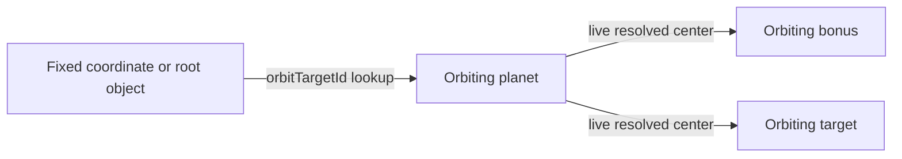

There is no explicit cycle detection. Orbit-reference graphs should be acyclic and IDs should be unique.

### Level rules

| Rule | Current behavior | Caveat |
|---|---|---|
| `maxTries` | Fails when `tries >= maxTries`. | Zero is treated as unset due to `|| null`. |
| `requiredBonuses` | Blocks target victory until enough bonuses have state `Hit`. | Zero is treated as unset. |
| `allowedMisses` | Fails when planet collision count reaches the value. | Zero is treated as unset. |
| `gravitationalConstant` | Replaces the physics constant for that level. | Default is `3.0`; use a positive finite number. |
| `scoreMultiplier` | Multiplies accumulated score after level completion. | Default `1.0`; applied to total score rather than only the current level. |
| `timeLimit` | Parsed, retained, and exported. | Not enforced by the current game loop. |
| `customBehaviors` | Parsed, retained, and exported. | No runtime dispatcher currently consumes it. |

## 9. Assets and audio

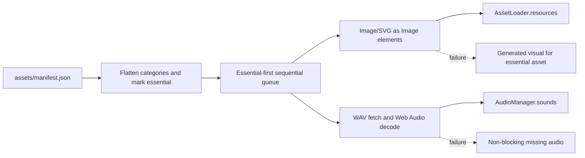

Manifest resource keys are normalized by category: `planet_<name>`, `sprite_<name>`, `ui_<name>`, and `audio_<name>`; animation names remain unchanged. Entity constructors receive the shared loader and may choose real sprites or programmatic fallbacks.

Operational constraints:

- Asset URLs are relative to the application root and therefore assume the repository directory layout.
- The startup loader currently attempts all assets, sequentially. `essential` controls priority and fallback generation, not a split between eager and lazy loading.
- `loadAssetOnDemand` exists, but its cache value shapes differ from eager loading for some media. Consumers should use typed getters unless that contract is normalized.
- Penguin animation metadata JSON is fetched separately when animations are constructed; it is not listed in the manifest.
- Web Audio may start suspended until a user gesture. Initialization failure turns sound off while allowing the game to continue.

## 10. Input, UI, and responsive boundaries

The internal gameplay coordinate space is always 800 x 600. CSS width/height scale presentation, while pointer conversion maps client coordinates back into canvas coordinates. Game mechanics and level coordinates must remain in the logical coordinate system.

Input action activation:

| Context | Active actions |
|---|---|
| All states | keyboard, window, UI |
| Menu | menu; gameplay disabled |
| Playing | gameplay; menu disabled |
| Paused | keyboard and UI only; world update returns before entity simulation |
| Editor active | editor; menu and gameplay disabled |
| Scoring/game over | state-specific gameplay/menu actions disabled; UI and keyboard remain available |

The code contains compatibility input methods on `Game`, but listener ownership belongs to `InputActionManager`. New input features should extend an action class and rely on action activation/deactivation to avoid duplicate listeners.

UI is hybrid:

- The persistent HUD and controls are DOM elements in `index.html`.
- Gameplay, entities, traces, and most visual feedback are Canvas 2D.
- Modal game screens use the Canvas-based `UIManager` stack.
- The level editor creates DOM panels/toolbars and draws Canvas guides.
- Mobile controls and fullscreen controls are created dynamically.

## 11. Level editor architecture

The editor is an embedded mode over the live `Game` aggregate, not an offline document editor. It receives constructor references from `Game`, enumerates live entity arrays, creates/removes objects, registers/deregisters physics bodies, edits orbit systems, and serializes the resulting graph.

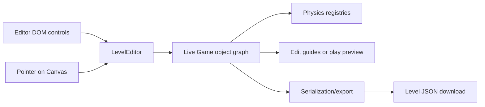

Architectural consequences:

- Edit and play previews share object identity and state, so reset logic matters when switching modes.
- Object membership is denormalized across `gameObjects`, typed arrays, singleton references, and physics registries. Add/remove operations must update all applicable stores.
- Stable IDs are part of the data model because orbit relationships serialize by ID.
- The editor exposes both comprehensive game export and its own serialization helpers; format changes must be reconciled across `Game`, `LevelEditor`, and `LevelLoader`.
- Export works. The editor's `saveLevel`, `undo`, and `redo` methods are placeholders and must not be presented as available persistence/history features.

## 12. Persistence and network behavior

Current persistence is intentionally small:

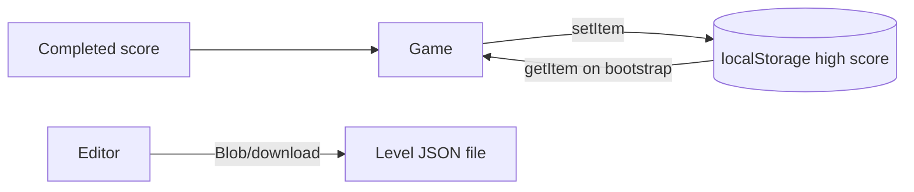

The HTML5 rewrite does **not** call the original Big Idea Fun leaderboard, does not encode/submit player names, and does not persist level progress or settings. Those behaviors appear only in historical documentation and `OldSource/`.

## 13. Design decisions and trade-offs

### Static, dependency-free browser application

**Why:** Minimal hosting, immediate browser execution, low dependency risk, and easy inspection against decompiled source.

**Trade-off:** No build-time type checking, tree shaking, asset hashing, or dependency-based test framework. Level definitions do have dependency-free runtime/CLI validation.

### Canvas 2D at a fixed logical resolution

**Why:** Matches the original 800 x 600 composition and makes legacy coordinates portable.

**Trade-off:** Responsive behavior is display scaling rather than adaptive world layout; DOM/editor overlays require careful coordinate conversion.

### Central `Game` aggregate

**Why:** Makes original global/stateful game logic straightforward to port and gives the editor one live graph to manipulate.

**Trade-off:** `Game` has many reasons to change and knows about rendering, physics, input-facing methods, UI, editor, persistence, and scoring.

### Data-driven levels with a factory

**Why:** Levels can be authored and loaded without per-level code. Factory aliases preserve compatibility with older and editor-generated formats.

**Trade-off:** The executable validator is the authoritative contract, but there is not yet a generated/formal JSON Schema for editor tooling and IDE completion.

### Two-pass orbit resolution

**Why:** Supports hierarchical and forward object references independent of declaration order.

**Trade-off:** IDs form a relational schema that requires coordinated validation and construction passes; current object-target lookup is intentionally limited to planets and bonuses.

### Fidelity-oriented physics

**Why:** Constants, state names, scoring, traces, crash timing, and reference assets are intended to preserve the Shockwave feel.

**Trade-off:** Collision orchestration remains split between `Game`, `Penguin`, and `Physics`, although the browser and headless engines now share the pure gravity integrator in `simulation.js`.

### Graceful media degradation

**Why:** Missing media should not prevent gameplay.

**Trade-off:** Startup can report completion with failed resources, so automated smoke tests or log monitoring are needed to catch packaging errors.

## 14. Architectural invariants

Maintain these constraints when changing the system:

1. Logical world, level, collision, and editor coordinates are 800 x 600 canvas coordinates, independent of CSS display size.
2. Use the single `AssetLoader`/`AudioManager` graph created at bootstrap; do not create per-entity audio contexts.
3. Add/remove entities through operations that update `gameObjects`, the correct typed collection, physics registration, singleton references, and render-cache invalidation.
4. Keep `Penguin.x`, `Penguin.y`, and `Penguin.position` synchronized until the representation is consolidated.
5. Assign unique stable IDs to every object used as an orbit target; keep orbit-reference graphs acyclic.
6. Apply object-referenced orbits only after all referenced objects have been created.
7. Transition game state through `setState` where possible so input listeners reconcile immediately.
8. New level fields need coordinated changes in loader defaults, editor property UI, serializer/export, examples, and tests.
9. Asset keys must match loader normalization and consumer lookup names.
10. A failed optional asset must not prevent bootstrap; an invalid structural level should fail validation rather than silently create a misleading partial level.

## 15. Extension playbooks

### Add a runtime entity type

1. Implement or extend an entity in `gameObjects.js` with `update(delta)` and `draw(ctx)` behavior.
2. Export it and add a `GameObjectFactory.create` branch.
3. Define JSON defaults and validation expectations.
4. Register it in the appropriate `Game` collections and subsystem registries during load.
5. Add constructor/default/property/serialization support in `LevelEditor` and `Game` export.
6. Add assets to the manifest if required, with programmatic fallback where appropriate.
7. Add a focused browser harness and a production-level integration test.
8. Update this document and `levels/README.md`.

### Add a level rule

1. Parse it in `LevelRules` without using truthiness if zero/false is meaningful.
2. Decide whether it is applied at load, checked per frame, checked on launch, or checked on target hit.
3. Reset any associated counters at attempt/level boundaries.
4. Export it from `Game.exportLevelRules` and expose it in the editor if authorable.
5. Test success, failure, reset, and final-level transitions.

### Add an orbit type

1. Add configuration and update math to `OrbitSystem`.
2. Add factory configuration in `GameObjectFactory.configureOrbitSystem`.
3. Add editor fields, guide rendering, serialization, and clone support.
4. Define fixed-center and object-target behavior.
5. Test missing targets, hierarchy, negative speed, resets, and cycles.

### Add an asset

1. Place it under the appropriate `assets/` category.
2. Add the manifest mapping and, if bootstrap-critical, the normalized key to `essential`.
3. Retrieve it through the category getter or define a stable typed getter.
4. Verify success and missing-file fallback paths from an HTTP server.

## 16. Testing and quality architecture

There are two current test surfaces:

1. Root `test_*.html` pages are manual browser harnesses for audio, bonus behavior, gravity/orbits, input, level transitions, mobile/responsive behavior, and editor scenarios. They are useful diagnostics but have no shared runner or assertions.
2. `testing/` contains dependency-free Node regression suites plus a headless simulator, shared level validation, and trajectory search CLI. The headless engine imports the production gravity integrator, resolves current object-linked circular orbits, mirrors the production nonlinear slingshot curve, and can render successful routes as terminal ASCII maps, but still approximates other runtime behavior.

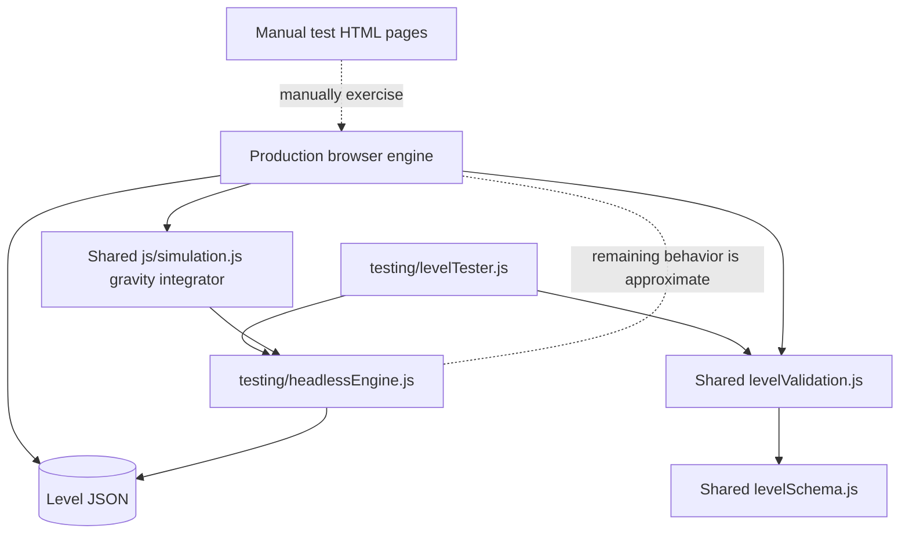

Verified limitations as of 2026-08-01:

- The headless engine shares gravity integration but still approximates object loading, target/collision semantics, rules, bonuses, and advanced orbits, so trajectory success does not prove complete browser-runtime parity.
- There is executable structural/semantic level validation but no JSON Schema artifact, linting, browser end-to-end runner, coverage, or CI pipeline. Node regression tests use the built-in `node:test` runner.

Recommended quality direction, in order:

1. Generate a JSON Schema from the shared contract for editor tooling and IDE completion.
2. Continue extracting pure production orbit, collision, and scoring functions for both browser and Node tests.
3. Extend deterministic tests to collision, bonuses, scoring, reset boundaries, and state transitions.
4. Add a browser automation smoke test for bootstrap, start, launch, pause, level completion, editor export, audio degradation, and mobile coordinate mapping.
5. Gate changes in CI with syntax checks, level validation, unit tests, and the browser smoke suite.

## 17. Risks and architectural debt

| Priority | Risk/debt | Impact | Suggested treatment |
|---|---|---|---|
| Medium | `Game` is a large coordinator and mutable data store. | High change coupling and difficult isolated tests. | Gradually separate session/level state, simulation, rendering, and persistence behind explicit interfaces. |
| Medium | Globals and circular module relationships (`Game`/loader/end screen/editor). | Initialization sensitivity and limited reuse. | Introduce a composition root/context and dependency inversion for transitions. |
| Medium | Level rules advertise unimplemented `timeLimit` and `customBehaviors`. | Authoring expectations differ from runtime. | Implement or reject them explicitly during validation. |
| Medium | Delayed pointing arrow path references an undefined variable. | Certain tutorial data can fail at level construction. | Normalize on `pointingAt` and cover immediate/delayed cases. |
| Medium | Truthy defaults reject meaningful zeros. | Rule and orbit values may not round-trip as expected. | Use nullish coalescing and explicit numeric validation. |
| Medium | A custom level gravity value can leak into a later default-gravity level because physics clear does not reset it and default application is conditional. | Level behavior depends on prior navigation order. | Assign the effective gravity constant unconditionally on every level load. |
| Medium | UIManager pointer coordinates do not scale from CSS pixels to the logical canvas in the same way gameplay input does. | Canvas UI hit targets can diverge from visuals under responsive/fullscreen scaling. | Centralize screen-to-canvas conversion and use it for every input surface. |
| Medium | Manifest-fetch failure does not call the asset completion callback; individual media failures do. | A missing/invalid manifest can leave bootstrap stuck while other packaging errors degrade silently. | Model bootstrap failure explicitly and surface a terminal retry/error UI. |
| Medium | Asset eager/on-demand cache shapes are inconsistent. | Consumers can receive wrappers, images, or SVG text under similar keys. | Define a single resource record contract. |
| Low | Object pooling methods reference `_objectPools`, which is not initialized and are currently unused. | Future callers would fail. | Remove until needed or initialize/test a documented pool. |
| Low | URL validation accepts levels through 25 while only 19 are shipped. | Requests 20–25 produce generated fallback levels unexpectedly. | Validate against `TOTAL_LEVELS` or explicitly document generated levels. |
| Low | Final-level detection checks a rule flag that is never populated. | Continue after level 19 generates further random levels instead of reaching the intended final game-over branch. | Derive finality from `TOTAL_LEVELS` and cover the terminal transition. |
| Low | Verbose console logging is present in factory/input hot paths. | Debug noise and possible performance cost. | Route all diagnostics through logger levels. |

## 18. Modernization seams

The safest incremental boundaries are:

- **Composition root:** keep construction and browser globals in `main.js`, passing an explicit context to subsystems.
- **Pure simulation core:** extract vector, gravity, orbit, collision, and scoring calculations with no DOM or globals.
- **Validated level model:** parse raw JSON into a normalized in-memory level before mutating `Game`.
- **Runtime world API:** encapsulate entity add/remove/query so typed arrays, physics registration, singleton references, and render cache cannot diverge.
- **Persistence adapter:** hide `localStorage` and file download behind small interfaces.
- **Renderer boundary:** pass a read-only world snapshot into rendering instead of allowing visual objects to own broad runtime access.

These seams support better tests and eventual TypeScript or framework adoption without requiring a rewrite of game behavior.

## 19. Repository and documentation map

| Path | Purpose | Authority |
|---|---|---|
| `ARCHITECTURE.md` | Current system design, contracts, flows, decisions, and debt | Primary architecture reference |
| `README.md` | Project entry point, run instructions, capabilities, document links | Current overview |
| `levels/README.md` | Current level authoring contract | Level-authoring reference |
| `LEVEL_EDITOR_DOCUMENTATION.md` | Detailed editor usage | Editor user guide; verify against editor code when changing behavior |
| `AUDIO_SYSTEM_IMPLEMENTATION.md` | Audio implementation notes | Focused implementation history |
| `BONUS_SYSTEM_IMPLEMENTATION.md` | Bonus implementation notes | Focused implementation history |
| `ORIGINAL_LEVELS_ANALYSIS.md` | Analysis of original levels | Historical/research reference |
| `SpacedPenguin_Documentation.md` | Original Shockwave behavior and porting provenance | Historical, not current runtime architecture |
| `OldSource/` | Decompiled Director/Lingo and extracted assets | Reference only; excluded from deployment |

## 20. Architect verification checklist

Before accepting a cross-cutting change, verify:

- Does it preserve the 800 x 600 logical coordinate contract across desktop, mobile, fullscreen, and editor input?
- Are bootstrap failures and optional-resource degradation explicit?
- Are game and penguin state transitions defined and input actions reconciled?
- Does every entity mutation keep all collections, physics, and render caches consistent?
- Does the level format round-trip loader → runtime/editor → export → loader?
- Are IDs unique and all orbit references resolvable and acyclic?
- Are attempt, level, total-score, and high-score reset boundaries correct?
- Is behavior tested against production seams/shared functions rather than only the headless approximation?
- Are new browser APIs compatible with static hosting and the no-build execution model?
- Were current docs updated separately from historical Shockwave provenance?
