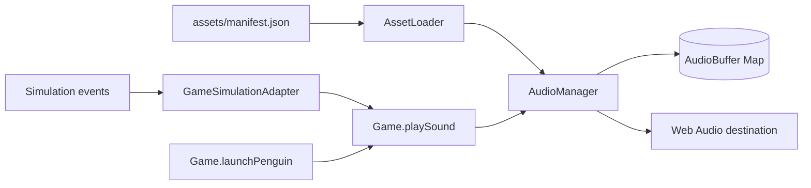

# Audio System

**Status:** Current focused implementation reference

**Scope:** Browser audio only; the headless simulator intentionally has no audio dependency.

## Ownership

`AssetLoader` constructs the shared `AudioManager`, reads audio entries from `assets/manifest.json`, and asks the manager to fetch/decode each WAV file. `Game` receives that same manager and exposes `playSound(name)` as a small browser-facing convenience boundary.

The deterministic simulation emits domain events. `GameSimulationAdapter` translates bonus, collision, and target events into sound calls; launch audio is triggered by `Game.launchPenguin()`. This keeps Web Audio out of gameplay transition code.

## Sound keys

| Key | Current trigger |
|---|---|
| `17_snd_launch` | Penguin launch |
| `16_snd_bonus` | `BONUS_COLLECTED` event |
| `20_snd_HitPlanet` | Planet collision or crash bounce event |
| `21_snd_enterShip` | Successful target handling |
| `15_Arp` | Available through `AudioManager.playArp()`; not background music |

## Loading and playback

1. The manifest audio category is flattened by `AssetLoader`.
2. `AudioManager.loadSound(name, url)` fetches the WAV as an `ArrayBuffer`.
3. `decodeAudioData` produces an `AudioBuffer` stored by sound name.
4. `playSound` creates a new `AudioBufferSourceNode` and `GainNode`, applies per-call volume, master volume, pitch, and looping, then starts playback.
5. A looped source is returned to the caller so it can be stopped.

Audio loading is currently part of the loader's priority-ordered eager asset pass, not true lazy loading.

## Volume and lifecycle

- Master volume defaults to `0.7` and is clamped to `0..1`.
- `setEnabled(false)` prevents loading/playback but does not affect gameplay.
- Volume is page-session state; it is not persisted to `localStorage`.
- `AudioManager` attempts to resume a suspended context during initialization. Browsers may reject this before a user gesture; there is no centralized gesture-time resume hook yet.

## Failure behavior

- Audio-context initialization failure disables audio without blocking graphics or gameplay.
- An individual fetch/decode failure omits that sound and logs the error.
- A play request for a disabled or unloaded sound returns `null`.
- Manifest-fetch failure is a broader bootstrap concern documented in `ARCHITECTURE.md`.

## Adding a sound

1. Put the WAV under `assets/audio/`.
2. Add it to the `audio` section of `assets/manifest.json`.
3. Trigger it from a browser adapter, game transition, or UI component—not from `simulationEngine.js`.
4. Test normal playback, muted/disabled playback, and a missing-file response over HTTP.

## Verification

`test_audio.html` is the manual component harness. Also exercise the main-game launch, bonus, collision, and target flows because those validate event-to-effect wiring that the standalone page does not cover.

## Known improvements

- Add a centralized user-gesture `AudioContext.resume()` path.
- Check `response.ok` before decode.
- Normalize eager and on-demand asset record shapes.
- Add automated browser smoke coverage for silent degradation and volume controls.
