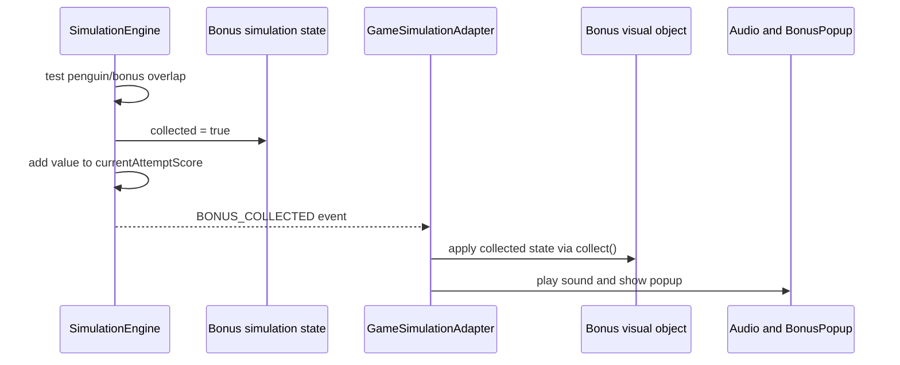

# Bonus System

**Status:** Current focused implementation reference

**Historical fidelity:** The `notHit`/`Hit` state names, value-returning `collect()`, rotation burst, and reset behavior derive from the original Lingo bonus behavior.

## Responsibilities

The bonus feature is deliberately split across layers:

| Layer | Responsibility |
|---|---|
| `Bonus` in `gameObjects.js` | Sprite loading/fallback drawing, visual state, rotation/pulse animation, `collect()`, and `reset()`. |
| `SimulationState` | Normalized bonus ID, position, width, value, collected flag, collection radius, and orbit state. |
| `SimulationEngine` | Exact overlap detection, collected-state transition, attempt-score increment, and `BONUS_COLLECTED` event. |
| `GameSimulationAdapter` | Apply collected/reset visual state, play `16_snd_bonus`, and show `BonusPopup`. |
| `LevelLoader` / validator | Validate and construct authored bonus definitions and orbits. |
| Headless runner | Consume the same collection transition; no visual, popup, or audio modeling. |

`Physics.checkBonusCollection()` remains only as legacy helper compatibility. Active browser and headless gameplay use `SimulationEngine`.

## Runtime sequence



Bonus collection happens before target-victory evaluation in the same fixed simulation slice. A bonus positioned at the target can therefore satisfy `requiredBonuses` before the target outcome is decided.

## Visual behavior

- `notHit` is collectible and uses `assets/sprites/bonus.svg`.
- `Hit` is collected and uses `assets/sprites/bonus_hit.svg`.
- The class can fetch those SVGs directly and falls back to a programmatically drawn star.
- Normal rotation speed is `3.0`; collection raises it to `30.0`, after which it decays toward the normal speed.
- `reset()` restores `notHit`, normal rotation speed, and the normal sprite.

Visual updates are not authoritative for collection or scoring. The simulation state is applied first, and the adapter synchronizes the visual object.

## Level contract

```json
{
  "type": "bonus",
  "position": { "x": 320, "y": 240 },
  "properties": {
    "id": "bonus_1",
    "value": 100,
    "orbit": null
  }
}
```

- `value` defaults to `100` and must be non-negative.
- Stable IDs are required when another object references the bonus as an orbit target.
- Bonuses may be orbit sources and may orbit a planet or another bonus.
- The attempt reset restores every bonus from the initial level state and clears `currentAttemptScore` while preserving aggregate try/collision counters.

## Headless optimization

Bonus motion is independent of the penguin, so exact position and orbit state are stored in `CompiledWorldTimeline` once per sweep. Each trajectory still owns its collected bit and score. Reusing motion cannot leak collection state between candidates.

## Verification

- `test_bonus.html` manually exercises sprite and visual behavior.
- `testing/simulationEngine.test.js` covers collection-before-target ordering, reset isolation, compiled-timeline parity, and headless/shared-kernel parity.
- `npm.cmd test` from `testing/` runs the automated suite.

## Known limitations

- Bonus SVG paths are still hard-coded in the visual class rather than sourced exclusively from the manifest.
- Editor export after play mode can capture mutable collected/position/orbit state and must be reviewed before promotion.
- The editor/runtime export codec is not fully lossless.
