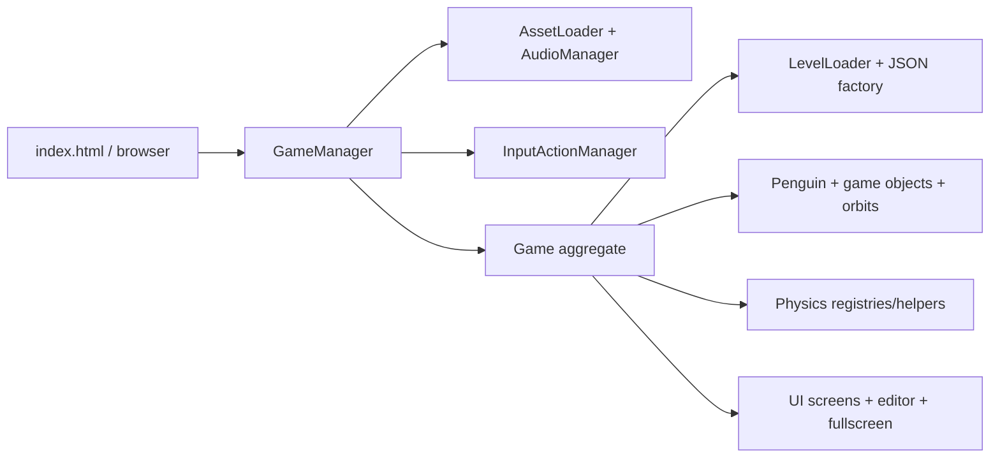

# Spaced Penguin HTML5 Rewrite

A browser-native rewrite of the classic Shockwave gravity-slingshot game, implemented with JavaScript ES modules, Canvas 2D, Web Audio, and JSON-authored levels.

## Current capabilities

- Nineteen authored levels with planets, bonuses, targets, tutorial text/arrows, and hierarchical orbit configurations
- Gravity-based launch, collision, bonus, scoring, retry, and level-completion flows
- Circular, elliptical, figure-8, and gravity-driven object orbits
- Manifest-driven images, sprite sheets, SVGs, and WAV audio with visual fallbacks
- Mouse, touch, keyboard, responsive-canvas, and fullscreen support
- Embedded live level editor with JSON download/export
- Local browser high-score persistence

The current runtime does not implement obstacle entities, online leaderboards, editor import/save/history, time-limit enforcement, or custom rule dispatch.

## Run locally

The application must be served over HTTP because ES modules, levels, assets, and animation metadata use `fetch`.

```powershell
python -m http.server 8000
```

Then open `http://localhost:8000`. A specific authored level can be selected with `http://localhost:8000/?level=5`.

There is no build or install step for the game itself.

## Architecture at a glance



The game keeps a fixed 800 x 600 logical world and scales its presentation to the viewport. `GameManager` owns bootstrap and the animation loop; `Game` owns the mutable runtime graph and coordinates levels, entities, physics, scoring, rendering, UI, and editing.

See [ARCHITECTURE.md](ARCHITECTURE.md) for system boundaries, lifecycle and state diagrams, data contracts, design decisions, invariants, extension paths, risks, and testing architecture.

## Repository map

```text
index.html                 Browser shell, HUD, canvas, responsive styling
js/                        Production ES modules
assets/                    Manifest, images, SVGs, audio, animation metadata
levels/                    Nineteen current JSON levels and authoring guide
testing/                   Node regression tests and approximate trajectory CLI
test_*.html                Manual browser component and integration harnesses
OldSource/                 Decompiled Shockwave source and extracted references
ARCHITECTURE.md             Current architect-oriented reference
LEVEL_EDITOR_DOCUMENTATION.md  Detailed editor guide
SpacedPenguin_Documentation.md Original Shockwave behavior/provenance
```

## Level authoring

Levels use a JSON envelope containing `startPosition`, `targetPosition`, `objects`, and `rules`. The current schema, object properties, canonical orbit form, rule support, and known limitations are documented in [levels/README.md](levels/README.md).

For a pointing tutorial arrow, use `pointingAt`:

```json
{
  "type": "pointingarrow",
  "position": { "x": 80, "y": 250 },
  "properties": {
    "pointingAt": { "x": 100, "y": 300 },
    "color": "#00FFFF"
  }
}
```

`pointAfterDelay` is not safe in the current loader because its delayed branch references an undefined variable; see the risk register in `ARCHITECTURE.md`.

## Testing status

The root `test_*.html` files are manual browser harnesses. The `testing/` package now provides Node regression tests for simulation timing, pause/input behavior, RAF ownership, and a headless baseline, plus a working trajectory CLI. Run them with `npm test` from `testing/` (or `npm.cmd test` in PowerShell environments that block the npm script shim).

Add `--ascii` to a level-tester sweep to print terminal maps of the reported successful trajectories. Maps mark the slingshot (`S`), target (`T`), root/static planets (`O`), orbiting planets (`o`), and interpolated flight path (`.`).

## Historical source

`OldSource/` contains decompiled Director/Lingo scripts and extracted assets used to study original behavior. It is not loaded or deployed by the HTML5 game. Historical claims about frame-based levels and network leaderboards describe the Shockwave version, not the current runtime.
