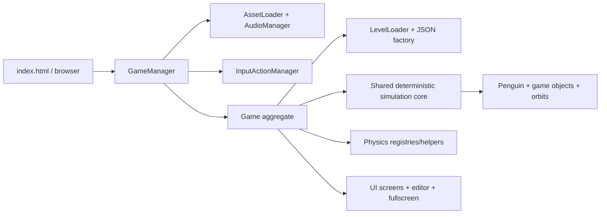

# Spaced Penguin HTML5 Rewrite

A browser-native rewrite of the classic Shockwave gravity-slingshot game, implemented with JavaScript ES modules, Canvas 2D, Web Audio, and JSON-authored levels.

## Current capabilities

- Twenty-five ported original levels with planets, bonuses, targets, tutorial text/arrows, and Director-compatible gravity
- Gravity-based launch, collision, bonus, scoring, retry, and level-completion flows
- Circular, elliptical, figure-8, and gravity-driven object orbits
- Manifest-driven images, sprite sheets, SVGs, and WAV audio with visual fallbacks
- Mouse, touch, keyboard, responsive-canvas, and fullscreen support
- Embedded live level editor with local saves, official/local/community source tabs, searchable/paginated browsing, context-aware play/open-copy actions, unsaved-change protection, and JSON download/export
- Local browser high-score persistence with all-time and today views, including an optional top-ten name/region entry
- Optional Node.js/SQLite community server with immutable verified publications and replay-validated per-level leaderboards

The current runtime does not implement obstacle entities, editor file import, time-limit enforcement, custom rule dispatch, or user accounts. Local saves remain in the browser. When a level server is configured, completed editor levels can be published once as immutable definitions and community-level scores can be submitted voluntarily with three-letter initials. Editor structural changes, canvas moves, object properties, and level settings have in-session undo/redo; JSON Export downloads the canonical definition.

## Run locally

The application must be served over HTTP because ES modules, levels, assets, and animation metadata use `fetch`.

```powershell
python -m http.server 8000
```

Then open `http://localhost:8000`. Select a default ported level with `http://localhost:8000/?level=5`. The previous hand-authored campaign is archived under the `manual` catalog and can be loaded with `http://localhost:8000/?level=manual:5`; advancing keeps that catalog active. Add `level_editor` to boot the selected level directly into the editor, for example `http://localhost:8000/?level=manual:5&level_editor` (or `?level_editor` for default level 1).

There is no build or install step for the game itself.

## Optional community level server

The server requires Node.js 22.13 or newer and uses Node's built-in SQLite support. Start it with:

```powershell
npm run serve:community
```

This starts the game at `http://127.0.0.1:4173` and the community API at
`http://127.0.0.1:3000`. The local launcher injects the API URL while serving
`app-config.js`, so no tracked files need to be edited. Both `127.0.0.1` and
`localhost` browser origins are accepted locally. Press Ctrl+C to stop both.

Use `npm run serve:levels` when running only the API for a separate deployment.

Environment variables:

- `LEVEL_SERVER_HOST`, default `127.0.0.1`
- `LEVEL_SERVER_PORT`, default `3000`
- `LEVEL_SERVER_DATABASE`, default `spaced-penguin-levels.sqlite`
- `LEVEL_SERVER_CORS_ORIGIN`, optional exact browser origin for split-origin deployments

For a separate deployment, enable it in the browser through the deployment-owned
`app-config.js`:

```js
globalThis.__SPACED_PENGUIN_APP_CONFIG__ = {
    levelServer: {
        baseUrl: 'http://127.0.0.1:3000',
        requestTimeoutMs: 8000
    }
};
```

Leave `baseUrl` as `null` for the original local-only behavior. A configured server outage does not prevent local saves, browsing, editing, or play. Public deployments should use HTTPS, a persistent host-local volume for the SQLite database, and SQLite-aware backups.

## Architecture at a glance



The game keeps a fixed 800 x 600 logical display surface while levels may opt into a larger world-space playfield. Legacy levels retain their exact fixed camera. Expanded levels may fit the full playfield or use a clamped, smoothly following camera. A centered contain transform maps the logical display to the viewport's actual backing resolution, with gutters where necessary. `GameManager` owns bootstrap and the animation loop; `Game` owns the mutable runtime graph and coordinates levels, entities, physics, scoring, rendering, UI, and editing.

See [ARCHITECTURE.md](ARCHITECTURE.md) for system boundaries, lifecycle and state diagrams, data contracts, design decisions, invariants, extension paths, risks, and testing architecture.

## Configuration

Reusable policy is grouped by domain under `js/config/`: gameplay and level defaults, runtime timing, rendering, UI, responsive/input behavior, editor behavior, assets, and semantic audio cues. Headless search and CLI policy lives in `testing/trajectoryConfig.js`. Level-authored positions, objects, orbits, and rules remain in JSON rather than global configuration.

All level consumers normalize through `LevelSchema` before constructing runtime or deterministic state. This gives the browser loader, editor, and headless tools the same defaults while preserving explicit values such as `0` and `false`. See [CONFIGURATION_MIGRATION.md](CONFIGURATION_MIGRATION.md) for ownership rules and verification gates.

## Repository map

```text
index.html                 Browser shell, HUD, canvas, responsive styling
js/                        Production ES modules
assets/                    Manifest, images, SVGs, audio, animation metadata
levels/                    Twenty-five default ports, archived manual catalog, and authoring guide
testing/                   Node tests, trajectory CLI, and organized manual harnesses
server/                    Optional Node HTTP API, SQLite repository, replay workers, and server tests
e2e/                       Automated Playwright browser smoke tests
OldSource/                 Decompiled Shockwave source and extracted references
ARCHITECTURE.md             Current architect-oriented reference
LEVEL_EDITOR_DOCUMENTATION.md  Detailed editor guide
SpacedPenguin_Documentation.md Original Shockwave behavior/provenance
```

## Level authoring

Levels use a JSON envelope containing `startPosition`, `targetPosition`, `objects`, and `rules`. The current schema, object properties, canonical orbit form, rule support, and known limitations are documented in [levels/README.md](levels/README.md).

For a pointing tutorial arrow, use `pointingAt`:

```json
{
  "type": "pointingarrow",
  "position": { "x": 80, "y": 250 },
  "properties": {
    "pointingAt": { "x": 100, "y": 300 },
    "color": "#00FFFF"
  }
}
```

Set `pointAfterDelay` to a positive number of seconds to hide the arrow until it begins pointing at `pointingAt`.

## Testing status

The pages under `testing/manual/` remain useful manual diagnostics and are indexed at `/testing/manual/` when the repository server is running. Automated coverage includes Node regression tests, validation of every shipped level, JavaScript syntax checks, configuration-policy checks, and Playwright browser smoke tests. The browser suite covers bootstrap, rendering, a real canvas launch, pause/resume, level completion, failed-audio degradation, mobile coordinate mapping, and editor JSON export.

Install the pinned development dependency and Chromium once, then run every local gate from the repository root:

```powershell
npm install
npx playwright install chromium
npm test
```

Individual gates are available as `npm run test:unit`, `npm run test:server`, `npm run test:levels`, `npm run test:syntax`, and `npm run test:e2e`. GitHub Actions runs the same gates on every push and pull request and retains Playwright traces, screenshots, videos, and the HTML report for diagnosis.

The browser accumulates display-frame time and advances gameplay in exact 1/60-second ticks; isolated headless sessions use the same transition kernel mutably with exact compiled world frames. Both paths share orbit, gravity, collision, bonus, target, rules, reset, launch, and scoring logic, so headless launch commands reproduce independently of display refresh rate.

Add `--ascii` to a level-tester sweep to print terminal maps of the reported successful trajectories. Maps mark the slingshot (`S`), target (`T`), root/static planets (`O`), orbiting planets (`o`), and interpolated flight path (`.`).

Add `--all-bonuses` to require a successful trajectory to collect every bonus before hitting the target, for example: `node .\levelTester.js --level ..\levels\level12.json --all-bonuses --samples 10000` from `testing/`. If the sweep finds no complete route, it says so and prints the five closest replayable paths, ranked by bonuses collected and then distance from the target.

Headless trajectories run for up to 120 simulated seconds by default so searches can wait for slow orbit alignments. Use `--max-time <seconds>` to choose a different limit.

Headless sweeps compile deterministic planet, bonus, and target world frames—including position, orbit angle, and orbit velocity—once per level and reuse them across candidates. Large sweeps automatically use up to four worker threads at 5,000 samples; override this with `--workers 1` or `--workers N`. Both modes preserve exact 1/60-second simulation results and deterministic candidate ordering.

Validate a definition without simulation using `node .\levelTester.js --validate-only --level <path>` from `testing/`. Browser and headless loading use the same structural and semantic validator, including finite coordinates, supported types, unique IDs, orbit references/cycles, and rule constraints.

## Historical source

`OldSource/` contains decompiled Director/Lingo scripts and extracted assets used to study original behavior. It is not loaded or deployed by the HTML5 game. Historical claims about frame-based levels and network leaderboards describe the Shockwave version, not the current runtime.

Run `python tools\extract_original_levels.py` to regenerate the readable intermediate JSON for all 25 original Director levels in `OldSource/extracted_levels/`. See `OldSource/extracted_levels/README.md` for format and provenance details.

Run `python tools\convert_original_levels.py` to regenerate the 25 default levels in `levels/`, then `npm run test:original-levels` to validate them and prove every port completable with the shared headless runner. The previous hand-authored campaign remains available in `levels/manual/` through the `manual:N` URL selector.
