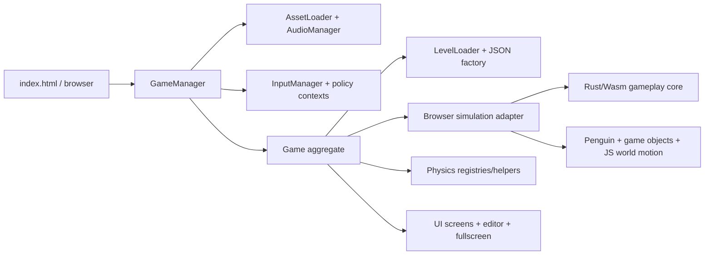

# Spaced Penguin HTML5 Rewrite

A browser-native rewrite of the classic Shockwave gravity-slingshot game, implemented with JavaScript ES modules, Canvas 2D, Web Audio, and JSON-authored levels.

Play online: [Spaced Penguin](https://newah1.github.io/SpacedPenguin/)

## Current capabilities

- Twenty-five ported original levels with planets, bonuses, targets, tutorial text/arrows, and Director-compatible gravity
- Gravity-based launch, collision, bonus, scoring, retry, and level-completion flows
- Circular, elliptical, figure-8, and gravity-driven object orbits
- Manifest-driven images, sprite sheets, SVGs, and WAV audio with visual fallbacks
- Mouse, touch, keyboard, responsive-canvas, and fullscreen support
- Embedded live level editor with local saves, official/local/community source tabs, searchable/paginated browsing, context-aware play/open-copy actions, unsaved-change protection, and JSON download/export
- Local browser high-score persistence with all-time and today views, including an optional top-ten name/region entry
- Optional Node.js/SQLite community server with immutable verified publications and replay-validated per-level leaderboards

The current runtime does not implement obstacle entities, editor file import, time-limit enforcement, custom rule dispatch, or user accounts. Local saves remain in the browser. When a level server is configured, completed editor levels can be published once as immutable definitions and community-level scores can be submitted voluntarily with three-letter initials. Editor structural changes, canvas moves, object properties, and level settings have in-session undo/redo; JSON Export downloads the canonical definition.

## Run locally

The application must be served over HTTP because ES modules, levels, assets, and animation metadata use `fetch`.

```powershell
python -m http.server 8000
```

Then open `http://localhost:8000`. Select a default ported level with `http://localhost:8000/?level=5`. The previous hand-authored campaign is archived under the `manual` catalog and can be loaded with `http://localhost:8000/?level=manual:5`; advancing keeps that catalog active. Add `level_editor` to boot the selected level directly into the editor, for example `http://localhost:8000/?level=manual:5&level_editor` (or `?level_editor` for default level 1).

There is no JavaScript bundler or install step for the game itself. The browser
loads the packaged Rust/Wasm simulator directly; rebuild it locally with
`npm.cmd run build:simulator-wasm` when changing the Rust core.

## Deploy to GitHub Pages

A `pages` workflow (`.github/workflows/pages.yml`) publishes the game as a
static single page app to GitHub Pages on every push to `master`. This makes
the game playable for anyone, directly in their browser, without needing git
or a local clone.

The workflow regenerates and verifies the domain contracts, rebuilds the Rust
simulator, and deploys that exact verified
`rust/simulator/pkg/spaced_penguin_simulator.wasm` artifact with the browser
files.

The site appears at `https://<owner>.github.io/<repo>/` (e.g.
`https://newah1.github.io/SpacedPenguin/`). A specific level can be reached with
`?level=N` (for example `?level=5` or `?level=manual:5`).

If you want to enable this on your own fork:

1. In the repository **Settings → Pages**, set **Source** to **GitHub Actions**.
2. Push to `master` (or run the `pages` workflow manually via **Actions**).

**Note:** This only deploys the browser game, not the community server.

## Optional community level server

The server requires Node.js 22.13 or newer and uses Node's built-in SQLite support. Start it with:

```powershell
npm run serve:community
```

This starts the game at `http://127.0.0.1:4173` and the community API at
`http://127.0.0.1:3000`. The local launcher injects the API URL while serving
`app-config.js`, so no tracked files need to be edited. Both `127.0.0.1` and
`localhost` browser origins are accepted locally. Press Ctrl+C to stop both.

Use `npm run serve:levels` when running only the API for a separate deployment.

Environment variables:

- `LEVEL_SERVER_HOST`, default `127.0.0.1`
- `LEVEL_SERVER_PORT`, default `3000`
- `LEVEL_SERVER_DATABASE`, default `spaced-penguin-levels.sqlite`
- `LEVEL_SERVER_CORS_ORIGIN`, optional exact browser origin for split-origin deployments

For a separate deployment, enable it in the browser through the deployment-owned
`app-config.js`:

```js
globalThis.__SPACED_PENGUIN_APP_CONFIG__ = {
  levelServer: {
    baseUrl: "http://127.0.0.1:3000",
    requestTimeoutMs: 8000,
  },
};
```

Leave `baseUrl` as `null` for the original local-only behavior. A configured server outage does not prevent local saves, browsing, editing, or play. Public deployments should use HTTPS, a persistent host-local volume for the SQLite database, and SQLite-aware backups.

## Architecture at a glance



The game keeps a fixed 800 x 600 logical display surface while levels may opt into a larger world-space playfield. Legacy levels retain their exact fixed camera. Expanded levels may fit the full playfield or use a clamped, smoothly following camera. A centered contain transform maps the logical display to the viewport's actual backing resolution, with gutters where necessary. `GameManager` owns bootstrap and the animation loop; `Game` owns the mutable runtime graph and coordinates levels, entities, physics, scoring, rendering, UI, and editing.

The [Rust simulation core](rust/simulator/README.md) is the behavioral source of truth for deterministic gameplay. The domain schemas remain authoritative for vocabulary and wire formats, while `js/simulation/simulationEngine.js` supplies world-motion orchestration and a compatibility fallback that must match Rust. New gameplay behavior is implemented in Rust first, mirrored in the fallback, and protected by browser/headless parity tests.

See [ARCHITECTURE.md](ARCHITECTURE.md) for system boundaries, lifecycle and state diagrams, data contracts, design decisions, invariants, extension paths, risks, and testing architecture.

## Configuration

Reusable policy is grouped by domain under `js/config/`: gameplay, runtime timing, rendering, UI, responsive/input behavior, editor behavior, assets, and semantic audio cues. The public `LEVEL_DEFAULTS` view is assembled by `js/config/gameConfig.js` from generated contracts: authored object defaults come from `domain/gameObjects.schema.json`, and level-rule defaults come from `domain/level.schema.json`. Headless search and CLI policy lives in `testing/trajectoryConfig.js`. Level-authored positions, objects, orbits, and rules remain in JSON rather than global configuration.

All level consumers normalize through `LevelSchema` before constructing runtime or deterministic state. This gives the browser loader, editor, and headless tools the same defaults while preserving explicit values such as `0` and `false`. Run `npm run generate:domain` after changing a schema; `npm run check:domain` detects stale generated views. See [CONFIGURATION_MIGRATION.md](CONFIGURATION_MIGRATION.md) for ownership rules and verification gates.

## Repository map

```text
index.html                 Browser shell, HUD, canvas, responsive styling
js/                        Production ES modules
assets/                    Manifest, images, SVGs, audio, animation metadata
levels/                    Twenty-five default ports, archived manual catalog, and authoring guide
testing/                   Node tests, trajectory CLI, and organized manual harnesses
domain/                    Canonical JSON Schema domain contracts
generated/                 Generated JavaScript, Rust, and external level contracts
rust/simulator/             Shared browser/headless Rust/Wasm transition core
rust/simulator/README.md    Authoritative Rust-core behavior and development guide
tools/generateDomainContracts.js  Deterministic contract generator and drift check
server/                    Optional Node HTTP API, SQLite repository, replay workers, and server tests
e2e/                       Automated Playwright browser smoke tests
OldSource/                 Decompiled Shockwave source and extracted references
ARCHITECTURE.md             Current architect-oriented reference
GAME_OBJECT_EXTENSION_GUIDE.md  Game-object addition process and extension-seam review
LEVEL_EDITOR_DOCUMENTATION.md  Detailed editor guide
SpacedPenguin_Documentation.md Original Shockwave behavior/provenance
```

## Level authoring

Levels use a JSON envelope containing `startPosition`, `targetPosition`, `objects`, and `rules`. The current schema, object properties, canonical orbit form, rule support, and known limitations are documented in [levels/README.md](levels/README.md).

Authored levels can use `repulsorstar` for a bright, non-colliding gravity source that pushes Kevin away. Its configurable fields are `radius`, `strength`, and `repulsionReach`; see the level authoring guide for the complete contract.

For a pointing tutorial arrow, use `pointingAt`:

```json
{
  "type": "pointingarrow",
  "position": { "x": 80, "y": 250 },
  "properties": {
    "pointingAt": { "x": 100, "y": 300 },
    "color": "#00FFFF"
  }
}
```

Set `pointAfterDelay` to a positive number of seconds to hide the arrow until it begins pointing at `pointingAt`.

## Testing status

The pages under `testing/manual/` remain useful manual diagnostics and are indexed at `/testing/manual/` when the repository server is running. Automated coverage includes Node regression tests, validation of every shipped level, JavaScript syntax checks, configuration-policy checks, and Playwright browser smoke tests. The browser suite covers bootstrap, rendering, a real canvas launch, pause/resume, level completion, failed-audio degradation, mobile coordinate mapping, and editor JSON export.

Install the pinned development dependency and Chromium once, then run every local gate from the repository root:

```powershell
npm install
npx playwright install chromium
npm test
```

Individual gates are available as `npm run test:unit`, `npm run test:server`, `npm run test:levels`, `npm run test:syntax`, and `npm run test:e2e`. GitHub Actions runs the same gates on every push and pull request and retains Playwright traces, screenshots, videos, and the HTML report for diagnosis.

The browser accumulates display-frame time and advances gameplay in exact 1/60-second ticks; isolated headless sessions use the same authoritative Rust candidate-transition function mutably with exact compiled world frames. Both paths share orbit inputs and Rust-owned gravity, collision, bonus, target, rule, reset, launch, and in-flight counter behavior, so headless launch commands reproduce independently of display refresh rate. Final level/campaign score assembly remains JavaScript session/replay policy outside the Rust step boundary.

Add `--ascii` to a level-tester sweep to print terminal maps of the reported successful trajectories. Maps mark the slingshot (`S`), target (`T`), root/static planets (`O`), orbiting planets (`o`), and interpolated flight path (`.`).

Add `--all-bonuses` to require a successful trajectory to collect every bonus before hitting the target, for example: `node .\levelTester.js --level ..\levels\level12.json --all-bonuses --samples 10000` from `testing/`. If the sweep finds no complete route, it says so and prints the five closest replayable paths, ranked by bonuses collected and then distance from the target.

Headless trajectories run for up to 120 simulated seconds by default so searches can wait for slow orbit alignments. Use `--max-time <seconds>` to choose a different limit.

Headless sweeps compile deterministic planet, bonus, and target world frames—including position, orbit angle, and orbit velocity—once per level and reuse them across candidates. Large sweeps automatically use up to four worker threads at 5,000 samples; override this with `--workers 1` or `--workers N`. Both modes preserve exact 1/60-second simulation results and deterministic candidate ordering.

The browser explicitly loads the packaged Rust/WebAssembly simulator during
bootstrap and falls back to the JavaScript kernel if initialization fails. It
keeps one persistent Rust state handle per live simulation, synchronizes
moving world positions through a reusable `Float64Array` buffer, and receives
a generated, versioned binary `StepPatch`/event-union response. The same Rust
candidate-transition function is available to the headless tester through
both Wasm and an optimized native executable. The native backend keeps level
validation and candidate-independent world compilation in the shared Node
adapter, then performs candidate simulation, success filtering, near-miss
ranking, and detailed trajectory capture inside Rust. Build and run it with:

```powershell
npm.cmd run build:simulator-native
npm.cmd run headless:native -- --level .\levels\level10.json --samples 10000 --max-time 5
```

The first `headless:native` invocation also verifies/builds the release
executable. It is written to
`rust/simulator/target/release/spaced-penguin-headless.exe` on Windows (without
the `.exe` suffix on Unix). The existing Wasm backend remains available:

```powershell
node .\testing\levelTester.js --level .\levels\level10.json --samples 10000 --max-time 5 --backend wasm
npm.cmd run benchmark:simulator-wasm -- .\levels\level10.json 10000 5
```

The Wasm transition covers planets, black holes, bonuses, slingshots, targets,
portals, speed boosters, deflector bumpers, one-way force fields, collisions, crash/reset behavior,
and enforced rules.
The existing deterministic orbit and waypoint graph supplies world motion to
the same Rust transition in both browser and headless execution. Wasm is the
portable headless CLI default; `--backend native` selects the release
executable and `--backend js` remains an explicit comparison path.

Gravity Sculpt also uses the packaged simulator. The editor starts a module
worker with one persistent Rust context at the minimum search budget or a
bounded context pool for larger searches, and submits whole
optimizer populations rather than crossing the JS/Wasm boundary per physics
tick. Ordinary generations return scored metrics and matched waypoint samples;
only the selected candidates are re-run with full preview capture. The search
stops waypoint-only trajectories at ordered-route completion, carries stage
populations across curriculum prefixes, defers launch-robustness probes to the
closing full-route joint generations, and stops stagnant stages early. Custom
variable hooks or levels with orbit/waypoint-controlled objects automatically
retain the exact JavaScript evaluator. Compare the two paths with:

```powershell
npm.cmd run benchmark:gravity-sculpt-wasm
npm.cmd run benchmark:gravity-sculpt-browser
```

The first command isolates a single Wasm evaluator in Node; the second measures
the production browser worker pool, including its startup cost.

Domain vocabulary is schema-first. Edit `domain/gameObjects.schema.json`,
`domain/simulation.schema.json`, or `domain/level.schema.json`, then run:

```powershell
npm.cmd run generate:domain
npm.cmd run check:domain
```

Generation produces browser-safe ES-module descriptors under `generated/js/`,
Rust serde models and event unions under `generated/rust/`, and
`generated/level.schema.json` for editors and IDEs. The ordered binary
simulation input and output layouts live in `domain/simulation.schema.json`;
their versions and fingerprints are recorded in
`domain/simulation-wire-versions.json`. The generator emits both sides of
each codec, rejects uncovered fields, and checks the checked-in manifest in
CI. Gameplay-authored properties must map to simulation state or carry a
reasoned projection exclusion. Batch trajectory envelopes may remain JSON
outside the per-frame hot path. Runtime constructors, rendering, audio,
cross-object validation, editor commands, orbit advancement, and gameplay
transition behavior remain handwritten.

Validate a definition without simulation using `node .\levelTester.js --validate-only --level <path>` from `testing/`. Browser and headless loading use the same structural and semantic validator, including finite coordinates, supported types, unique IDs, orbit references/cycles, and rule constraints.

## Historical source

`OldSource/` contains decompiled Director/Lingo scripts and extracted assets used to study original behavior. It is not loaded or deployed by the HTML5 game. Historical claims about frame-based levels and network leaderboards describe the Shockwave version, not the current runtime.

Run `python tools\extract_original_levels.py` to regenerate the readable intermediate JSON for all 25 original Director levels in `OldSource/extracted_levels/`. See `OldSource/extracted_levels/README.md` for format and provenance details.

Run `python tools\convert_original_levels.py` to regenerate the 25 default levels in `levels/`, then `npm run test:original-levels` to validate them and prove every port completable with the shared headless runner. The previous hand-authored campaign remains available in `levels/manual/` through the `manual:N` URL selector.
