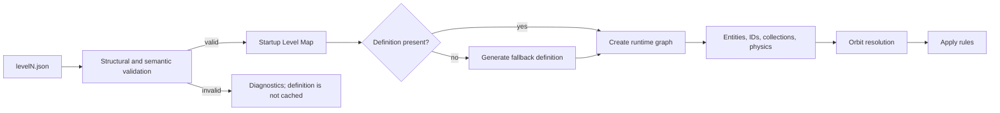

# Spaced Penguin Level Authoring Reference

This directory contains the 19 JSON levels loaded by the current HTML5 runtime. Shared vocabulary lives in `js/levelSchema.js`, executable validation in `js/levelValidation.js`, and construction in `js/levelLoader.js`. There is not yet a generated JSON Schema artifact.

For system-wide context and architectural limitations, see [`../ARCHITECTURE.md`](../ARCHITECTURE.md).

## Top-level shape

```json
{
  "name": "Level Name",
  "description": "Optional description",
  "startPosition": { "x": 100, "y": 300 },
  "targetPosition": { "x": 700, "y": 300 },
  "objects": [],
  "rules": {}
}
```

- `startPosition` creates the penguin and, when no slingshot object is present, the default slingshot.
- `targetPosition` is used only when no target object is present.
- Positions are logical 800 x 600 canvas coordinates, regardless of CSS/display scaling.
- `description` is preserved in the loaded definition but is not consumed by gameplay.
- A missing authored level is procedurally generated when requested.

## Object envelope

```json
{
  "type": "planet",
  "position": { "x": 400, "y": 250 },
  "properties": {}
}
```

Top-level `position` is preferred. The loader also accepts `properties.x` and `properties.y` as a compatibility form. Type aliases and normalization are shared by validation and loading; use the canonical lowercase names shown below.

## Supported types

### Planet

```json
{
  "type": "planet",
  "position": { "x": 400, "y": 250 },
  "properties": {
    "id": "planet_1",
    "name": "Center planet",
    "radius": 40,
    "mass": 300,
    "gravitationalReach": 5000,
    "planetType": "planet_sun"
  }
}
```

Defaults are `radius: 30`, `mass: 100`, and `gravitationalReach: 5000`. For compatibility with shipped editor exports, an omitted, null, or zero `gravitationalReach` also resolves to `5000`; use `mass: 0` when a planet must exert no gravity. Planet types must correspond to manifest-facing names such as `planet_grey`, `planet_pink`, `planet_red_gumball`, `planet_saturn`, or `planet_sun`.

### Bonus

```json
{
  "type": "bonus",
  "position": { "x": 300, "y": 150 },
  "properties": {
    "id": "bonus_1",
    "name": "Upper bonus",
    "value": 200
  }
}
```

The default value is 100.

### Target

```json
{
  "type": "target",
  "position": { "x": 700, "y": 300 },
  "properties": {
    "id": "target_1",
    "width": 60,
    "height": 60,
    "spriteType": "ship_open"
  }
}
```

Only the first lowercase target definition is used as the singleton goal. If absent, the loader creates a 60 x 60 default target at `targetPosition`.

### Slingshot

```json
{
  "type": "slingshot",
  "position": { "x": 100, "y": 300 },
  "properties": {
    "anchorX": 100,
    "anchorY": 300,
    "stretchLimit": 100,
    "velocityMultiplier": 15
  }
}
```

Only the first lowercase slingshot definition is used. Without one, a default is created at `startPosition`.

### Tutorial text

Both `text` and `textobject` are accepted.

```json
{
  "type": "textobject",
  "position": { "x": 120, "y": 80 },
  "properties": {
    "content": "<b>Drag and release Kevin.</b>",
    "width": 240,
    "height": 80,
    "visible": true,
    "textAlign": "left",
    "fontSize": 16,
    "fontFamily": "Arial, sans-serif",
    "color": "#FFFFCC",
    "backgroundColor": "rgba(0, 0, 0, 0.7)",
    "padding": 10,
    "autoSize": true,
    "fadeIn": true,
    "fadeInDuration": 1,
    "showAfterDelay": 2,
    "renderOrder": 8
  }
}
```

Text formatting is parsed into Canvas text runs; it is not arbitrary DOM HTML execution.

### Pointing arrow

Both `arrow` and `pointingarrow` create the tutorial `PointingArrow`. The separate off-screen flight arrow is runtime-owned and is not authored in level JSON.

```json
{
  "type": "pointingarrow",
  "position": { "x": 150, "y": 250 },
  "properties": {
    "pointingAt": { "x": 100, "y": 300 },
    "color": "#00FFFF",
    "glowColor": "#0099FF",
    "baseWidth": 20,
    "scaleWithDistance": true,
    "maxDistance": 300,
    "minWidth": 15,
    "maxWidth": 60,
    "pulseSpeed": 3,
    "minAlpha": 0.6,
    "maxAlpha": 1,
    "renderOrder": 9
  }
}
```

Use `pointingAt`, not the older documented `pointTo` name. An optional positive `pointAfterDelay` value hides the arrow and reveals it at that target after the configured number of seconds.

### Unsupported placeholder

`obstacle` is recognized by the factory but is not implemented; the loader logs a warning and creates no object.

## Orbit configuration

The canonical/current form is the one produced by the editor:

```json
{
  "orbit": {
    "orbitCenter": { "x": 400, "y": 250 },
    "orbitTargetId": null,
    "orbitRadius": 100,
    "orbitSpeed": 1,
    "orbitAngle": 0,
    "orbitType": "circular",
    "orbitParams": {}
  }
}
```

The compatibility aliases `center`, `targetId`, `radius`, `speed`, `angle`, `type`, and `params` are also accepted. Do not place type-specific values directly in the orbit object: they belong under `orbitParams` (or legacy `params`).

An orbit is ignored when it has neither an object target nor meaningful fixed-center/radius data.

### Circular

```json
{
  "orbitCenter": { "x": 400, "y": 250 },
  "orbitTargetId": null,
  "orbitRadius": 100,
  "orbitSpeed": 1,
  "orbitAngle": 0,
  "orbitType": "circular",
  "orbitParams": {}
}
```

Negative speed reverses direction.

### Elliptical

```json
{
  "orbitCenter": { "x": 400, "y": 250 },
  "orbitTargetId": null,
  "orbitRadius": 120,
  "orbitSpeed": 0.8,
  "orbitAngle": 0,
  "orbitType": "elliptical",
  "orbitParams": {
    "semiMajorAxis": 120,
    "semiMinorAxis": 80,
    "rotation": 0.5
  }
}
```

If axes are omitted, the major axis defaults to `orbitRadius` and the minor axis to 70% of it. Rotation is in radians.

### Figure-8

```json
{
  "orbitCenter": { "x": 400, "y": 250 },
  "orbitTargetId": null,
  "orbitRadius": 100,
  "orbitSpeed": 0.6,
  "orbitAngle": 0,
  "orbitType": "figure8",
  "orbitParams": {
    "size": 100
  }
}
```

### Gravity orbit

```json
{
  "orbitCenter": { "x": 400, "y": 250 },
  "orbitTargetId": null,
  "orbitRadius": 150,
  "orbitSpeed": 0,
  "orbitAngle": 0,
  "orbitType": "gravity",
  "orbitParams": {
    "initialVelocity": { "x": 0, "y": 50 },
    "gravityStrength": 1000
  }
}
```

Gravity orbit motion is numerically integrated. Editor export after a play preview can capture current rather than original position/velocity, so review exported values.

### Hierarchical/object-referenced orbit

```json
[
  {
    "type": "planet",
    "position": { "x": 400, "y": 250 },
    "properties": { "id": "planet_root", "radius": 40, "mass": 300 }
  },
  {
    "type": "bonus",
    "position": { "x": 500, "y": 250 },
    "properties": {
      "id": "bonus_child",
      "value": 200,
      "orbit": {
        "orbitCenter": null,
        "orbitTargetId": "planet_root",
        "orbitRadius": 100,
        "orbitSpeed": 1,
        "orbitAngle": 0,
        "orbitType": "circular",
        "orbitParams": {}
      }
    }
  }
]
```

The loader constructs ordinary objects and IDs first, then attaches orbits, so forward references between planets and bonuses are allowed. Validation requires author IDs to be unique and rejects missing targets, self-references, and cycles before runtime construction.

Current hierarchy limitations:

- Orbit targets may currently be planet or bonus IDs.
- Orbiting sources may be planets, bonuses, or the target.
- Active slingshot, text, and pointing-arrow orbit definitions are rejected because those entities are not part of simulation orbit stepping.
- Hierarchical parents are resolved before children regardless of declaration order.

### Custom orbit

Programmatic `OrbitSystem` instances can receive custom functions. JSON cannot represent those functions; `orbitType: "custom"` currently falls back to circular motion.

## Rules

```json
{
  "rules": {
    "maxTries": 5,
    "scoreMultiplier": 1.5,
    "requiredBonuses": 3,
    "allowedMisses": 2,
    "gravitationalConstant": 2.5,
    "timeLimit": null,
    "customBehaviors": []
  }
}
```

| Field | Runtime status |
|---|---|
| `maxTries` | Maximum launched attempts; the last allowed shot runs to an outcome before failure is evaluated. |
| `requiredBonuses` | Enforced when the target is reached. |
| `allowedMisses` | Maximum planet collisions tolerated; failure occurs when the count exceeds it. |
| `gravitationalConstant` | Applied to the level physics system. Default is 3.0. |
| `scoreMultiplier` | Applied after completion to the accumulated score. Default is 1.0. |
| `timeLimit` | Parsed but not enforced. |
| `customBehaviors` | Parsed but not dispatched. |

Rule defaults use nullish semantics, so meaningful zero values such as `gravitationalConstant: 0` and `requiredBonuses: 0` are preserved. Validation rejects zero where the contract requires a positive value, such as `maxTries` and `scoreMultiplier`.

## Loading and fallback behavior



- All 19 authored files are fetched sequentially during bootstrap.
- HTTP status, JSON parsing, structure, numeric constraints, composition, IDs, orbit references/cycles, and level rules are checked before caching.
- Unknown object types and invalid definitions are rejected rather than partially instantiated.
- A missing level definition is masked by random fallback generation when selected.

Validation returns all discovered diagnostics in one pass. Each diagnostic has a stable code, severity, JSON-style path, and human-readable message. To validate without running a trajectory:

```powershell
cd testing
node .\levelTester.js --validate-only --level ..\levels\level10.json
```

## Editor export and round-trip caveats

The editor exports a browser-downloaded JSON file. There is no editor import picker, server save, autosave, local-storage save, undo, or redo implementation.

Export is not a lossless authored-model codec:

- It can include mutable runtime positions, states, orbit angles, and gravity velocity after play mode.
- It writes some properties the loader does not restore.
- It emits inert orbit blocks for objects that own a default orbit system.
- Multiple target/slingshot instances are not preserved by loading.
- Cloning an object-referenced orbit can lose its target relationship.

Review and normalize exported JSON before promoting it to `levels/levelN.json`.

## Authoring checklist

1. Use lowercase supported type names and top-level logical `position` values.
2. Provide exactly one target and one slingshot, or rely on their top-level defaults.
3. Give every referenced orbit object a unique stable ID.
4. Put elliptical, figure-8, and gravity values inside `orbitParams`.
5. Keep object-reference graphs acyclic and favor planet/bonus targets.
6. Use only operational rules unless intentionally storing future metadata.
7. Serve over HTTP and test the level in the production game, not only a standalone harness.
8. Test reset/retry, bonus requirements, collisions, completion, responsive input, and editor export.
9. Inspect the console for unknown types, missing media, and load failures.
10. Recheck exported initial state after any editor play preview.
