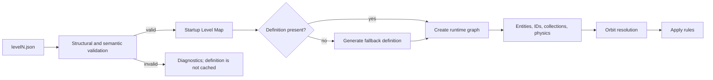

# Spaced Penguin Level Authoring Reference

This directory contains the 25 JSON levels loaded by the default HTML5 runtime. The archived `manual/` catalog contains 20 earlier hand-authored levels. Canonical declarative vocabulary lives in `domain/`, generated runtime descriptors are under `generated/js/`, executable normalization and semantic validation remain in `js/levels/levelSchema.js` and `js/levels/levelValidation.js`, and construction remains in `js/levels/levelLoader.js`. The generated external schema is `generated/level.schema.json`.

Every browser, editor, and headless consumer passes a level through the shared `LevelSchema` normalizer. Omitted fields receive the same configured defaults everywhere; explicit `0`, `false`, and empty-string values are retained unless validation rejects them for that specific field.

For system-wide context and architectural limitations, see [`../ARCHITECTURE.md`](../ARCHITECTURE.md).

## Top-level shape

```json
{
  "name": "Level Name",
  "description": "Optional description",
  "startPosition": { "x": 100, "y": 300 },
  "targetPosition": { "x": 700, "y": 300 },
  "bounds": {
    "stage": { "x": 0, "y": 0, "width": 2400, "height": 1800 },
    "flight": { "x": -200, "y": -200, "width": 2800, "height": 2200 }
  },
  "camera": { "mode": "follow", "zoom": 1 },
  "objects": [],
  "rules": {}
}
```

- `startPosition` creates the penguin and, when no slingshot object is present, the default slingshot.
- `targetPosition` is used only when no target object is present.
- Positions are world coordinates, regardless of CSS/display scaling. Levels without `camera` retain the legacy fixed 800 x 600 view.
- `description` is preserved in the loaded definition but is not consumed by gameplay.
- A missing authored level is procedurally generated when requested.

## Playfield and camera

`bounds.stage` is the authored playfield. `bounds.flight` is the larger terminal boundary; Kevin may fly beyond the visible playfield before becoming lost. The editor derives a 200-unit buffer on each side when the playfield size is changed, while preserving explicitly loaded flight bounds until then.

`camera` is optional. Omitting it is the compatibility contract for shipped and historical levels: the world is rendered through the original fixed 800 x 600 camera. Expanded levels support:

- `{ "mode": "fit" }` to show the complete playfield in one shot.
- `{ "mode": "follow", "zoom": 1 }` to follow Kevin with a dead zone, easing, and playfield-edge clamping.

Follow zoom must be greater than zero. The runtime raises an undersized zoom just enough to ensure the camera view can remain wholly inside the playfield.

## Object envelope

```json
{
  "type": "planet",
  "position": { "x": 400, "y": 250 },
  "properties": {}
}
```

Top-level `position` is preferred. The loader also accepts `properties.x` and `properties.y` as a compatibility form. Type aliases and normalization are shared by validation and loading; use the canonical lowercase names shown below.

## Supported types

### Planet

```json
{
  "type": "planet",
  "position": { "x": 400, "y": 250 },
  "properties": {
    "id": "planet_1",
    "name": "Center planet",
    "radius": 40,
    "mass": 300,
    "gravitationalReach": 5000,
    "planetType": "planet_sun"
  }
}
```

Defaults are `radius: 30`, `mass: 100`, and `gravitationalReach: 5000`. For compatibility with shipped editor exports, an omitted, null, or zero `gravitationalReach` also resolves to `5000`; use `mass: 0` when a planet must exert no gravity. Planet types must correspond to manifest-facing names such as `planet_grey`, `planet_pink`, `planet_red_gumball`, `planet_saturn`, or `planet_sun`.

### Black hole

```json
{
  "type": "blackhole",
  "position": { "x": 400, "y": 250 },
  "properties": {
    "id": "blackhole_1",
    "name": "The Void",
    "radius": 34,
    "mass": 500,
    "gravitationalReach": 5000
  }
}
```

Black holes use the same gravity model as planets but never collide with Kevin. Their collision radius is normalized to `0` and `collidable` is always `false`. The editor exposes radius, mass, gravitational reach, and orbit controls; the animated accretion particles are render-only and do not affect deterministic simulation. Black holes may be used anywhere a planet is accepted as an orbit source or orbit target.

### Bonus

```json
{
  "type": "bonus",
  "position": { "x": 300, "y": 150 },
  "properties": {
    "id": "bonus_1",
    "name": "Upper bonus",
    "value": 200
  }
}
```

The default value is 100.

### Target

```json
{
  "type": "target",
  "position": { "x": 700, "y": 300 },
  "properties": {
    "id": "target_1",
    "width": 60,
    "height": 60,
    "spriteType": "ship_open"
  }
}
```

The validated model permits at most one target definition. If absent, the loader creates a 60 x 60 default target at `targetPosition`.

### Slingshot

```json
{
  "type": "slingshot",
  "position": { "x": 100, "y": 300 },
  "properties": {
    "anchorX": 100,
    "anchorY": 300,
    "stretchLimit": 100,
    "velocityMultiplier": 15
  }
}
```

The validated model permits at most one slingshot definition. Without one, a default is created at `startPosition`.

### Tutorial text

Both `text` and `textobject` are accepted.

```json
{
  "type": "textobject",
  "position": { "x": 120, "y": 80 },
  "properties": {
    "content": "<b>Drag and release Kevin.</b>",
    "width": 240,
    "height": 80,
    "visible": true,
    "textAlign": "left",
    "fontSize": 16,
    "fontFamily": "Arial, sans-serif",
    "color": "#FFFFCC",
    "backgroundColor": "rgba(0, 0, 0, 0.7)",
    "padding": 10,
    "autoSize": true,
    "fadeIn": true,
    "fadeInDuration": 1,
    "showAfterDelay": 2,
    "renderOrder": 8
  }
}
```

Text formatting is parsed into Canvas text runs; it is not arbitrary DOM HTML execution.
In the level editor, **Width / Wrap Limit** controls where text wraps. With `autoSize`
enabled, the rendered background can shrink to its content while retaining this wrap limit.

### Pointing arrow

Both `arrow` and `pointingarrow` create the tutorial `PointingArrow`. The separate off-screen flight arrow is runtime-owned and is not authored in level JSON.

### Portals

Portals are reciprocal red/blue endpoint pairs. Each endpoint requires a unique `id` and a `pairedPortalId` pointing back to the other endpoint. `rotation` is expressed in degrees; momentum is rotated from the entrance frame into the exit frame without changing speed. The editor arrow identifies the outward, active face on one of the ellipse's long rim sides: the penguin must approach against that arrow to enter and exits through that face. A rotation of `0` faces up. `playSound` defaults to `true`.

```json
{
  "type": "portal",
  "position": { "x": 260, "y": 220 },
  "properties": {
    "id": "portal_pair_1_red",
    "pairedPortalId": "portal_pair_1_blue",
    "color": "red",
    "width": 48,
    "height": 18,
    "rotation": 0,
    "playSound": true
  }
}
```

### Speed booster panels

Speed boosters redirect Kevin's full incoming momentum along their `rotation` (in degrees, where `0` points right) and then multiply its magnitude by `speedMultiplier`. Use the default multiplier of `1` to redirect without adding speed. `playSound` defaults to `true` and uses the standard woosh.

```json
{
  "type": "speedbooster",
  "position": { "x": 420, "y": 250 },
  "properties": {
    "id": "boost_1",
    "width": 64,
    "height": 32,
    "rotation": 90,
    "speedMultiplier": 1.5,
    "playSound": true
  }
}
```

### Deflector bumpers

Deflector bumpers are circular, non-terminal collision objects. Kevin's incoming momentum is reflected across the surface normal at the swept impact point, so off-center contacts create bank shots and fast movement cannot tunnel through the bumper. `restitution` multiplies both the reflected speed and the remaining movement in the impact tick: `1` preserves speed, values below `1` damp the bounce, and values above `1` add speed. `playSound` defaults to `true` and reuses the planet-impact cue. Bumpers support waypoint motion.

```json
{
  "type": "deflectorbumper",
  "position": { "x": 420, "y": 250 },
  "properties": {
    "id": "bumper_1",
    "radius": 30,
    "restitution": 1,
    "color": "#ff4fd8",
    "playSound": true
  }
}
```

The aliases `deflector` and `bumper` are accepted, but exported levels use `deflectorbumper`.

```json
{
  "type": "pointingarrow",
  "position": { "x": 150, "y": 250 },
  "properties": {
    "pointingAt": { "x": 100, "y": 300 },
    "color": "#00FFFF",
    "glowColor": "#0099FF",
    "baseWidth": 20,
    "scaleWithDistance": true,
    "maxDistance": 300,
    "minWidth": 15,
    "maxWidth": 60,
    "pulseSpeed": 3,
    "minAlpha": 0.6,
    "maxAlpha": 1,
    "renderOrder": 9
  }
}
```

Use `pointingAt`, not the older documented `pointTo` name. An optional positive `pointAfterDelay` value hides the arrow and reveals it at that target after the configured number of seconds.

### Unsupported placeholder

`obstacle` has a dormant factory placeholder but is not part of the shared loadable vocabulary. Validation rejects it before runtime construction.

## Orbit configuration

The canonical/current form is the one produced by the editor:

```json
{
  "orbit": {
    "orbitCenter": { "x": 400, "y": 250 },
    "orbitTargetId": null,
    "orbitRadius": 100,
    "orbitSpeed": 1,
    "orbitAngle": 0,
    "orbitType": "circular",
    "orbitParams": {}
  }
}
```

The compatibility aliases `center`, `targetId`, `radius`, `speed`, `angle`, `type`, and `params` are also accepted. Do not place type-specific values directly in the orbit object: they belong under `orbitParams` (or legacy `params`).

An orbit is ignored when it has neither an object target nor meaningful fixed-center/radius data.

### Circular

```json
{
  "orbitCenter": { "x": 400, "y": 250 },
  "orbitTargetId": null,
  "orbitRadius": 100,
  "orbitSpeed": 1,
  "orbitAngle": 0,
  "orbitType": "circular",
  "orbitParams": {}
}
```

Negative speed reverses direction.

### Elliptical

```json
{
  "orbitCenter": { "x": 400, "y": 250 },
  "orbitTargetId": null,
  "orbitRadius": 120,
  "orbitSpeed": 0.8,
  "orbitAngle": 0,
  "orbitType": "elliptical",
  "orbitParams": {
    "semiMajorAxis": 120,
    "semiMinorAxis": 80,
    "rotation": 0.5
  }
}
```

If axes are omitted, the major axis defaults to `orbitRadius` and the minor axis to 70% of it. Rotation is in radians.

### Figure-8

```json
{
  "orbitCenter": { "x": 400, "y": 250 },
  "orbitTargetId": null,
  "orbitRadius": 100,
  "orbitSpeed": 0.6,
  "orbitAngle": 0,
  "orbitType": "figure8",
  "orbitParams": {
    "size": 100
  }
}
```

### Gravity orbit

```json
{
  "orbitCenter": { "x": 400, "y": 250 },
  "orbitTargetId": null,
  "orbitRadius": 150,
  "orbitSpeed": 0,
  "orbitAngle": 0,
  "orbitType": "gravity",
  "orbitParams": {
    "initialVelocity": { "x": 0, "y": 50 },
    "gravityStrength": 1000
  }
}
```

Gravity orbit motion is numerically integrated. Editor export after a play preview can capture current rather than original position/velocity, so review exported values.

### Director compatibility gravity

`orbitType: "director-gravity"` is reserved for generated ports of the original Lingo `Orbiting` behavior. Its `orbitParams.gravitySources` array supports one to three fixed positions or planet/bonus IDs, with source mass and collision-distance clamps. It advances in discrete `sourceFrameRate` ticks and is intentionally separate from the editor's modern gravity orbit. See `ORIGINAL_PORTS.md` and `tools/convert_original_levels.py`; hand-authored levels should normally use `gravity`.

### Hierarchical/object-referenced orbit

```json
[
  {
    "type": "planet",
    "position": { "x": 400, "y": 250 },
    "properties": { "id": "planet_root", "radius": 40, "mass": 300 }
  },
  {
    "type": "bonus",
    "position": { "x": 500, "y": 250 },
    "properties": {
      "id": "bonus_child",
      "value": 200,
      "orbit": {
        "orbitCenter": null,
        "orbitTargetId": "planet_root",
        "orbitRadius": 100,
        "orbitSpeed": 1,
        "orbitAngle": 0,
        "orbitType": "circular",
        "orbitParams": {}
      }
    }
  }
]
```

The loader constructs ordinary objects and IDs first, then attaches orbits, so forward references between planets and bonuses are allowed. Validation requires author IDs to be unique and rejects missing targets, self-references, and cycles before runtime construction.

Current hierarchy limitations:

- Orbit targets may currently be planet or bonus IDs.
- Orbiting sources may be planets, bonuses, or the target.
- Active slingshot, text, and pointing-arrow orbit definitions are rejected because those entities are not part of simulation orbit stepping.
- Hierarchical parents are resolved before children regardless of declaration order.

### Custom orbit

Programmatic `OrbitSystem` instances can receive custom functions. JSON cannot represent those functions; `orbitType: "custom"` currently falls back to circular motion.

## Waypoint path configuration

Any authored object may follow a fixed waypoint path. Put `waypointPath` beside the object's other properties:

```json
{
  "type": "planet",
  "position": { "x": 200, "y": 200 },
  "properties": {
    "id": "moving_planet",
    "waypointPath": {
      "waypoints": [
        { "x": 200, "y": 200 },
        { "x": 500, "y": 200 },
        { "x": 500, "y": 400 }
      ],
      "speed": 80,
      "mode": "pingpong",
      "phase": 0
    }
  }
}
```

- `waypoints` requires at least two finite world-coordinate points.
- `speed` is a non-negative number in logical world units per second. Zero pauses the object.
- `mode: "pingpong"` follows the list forward and then backward. `mode: "loop"` adds a closing segment from the final waypoint to the first.
- `phase` is the optional starting distance along the repeating route. It defaults to zero.
- An object cannot combine `orbit` and `waypointPath`; validation rejects ambiguous double-motion definitions.

Planets, black holes, bonuses, targets, portals, speed boosters, and the slingshot move inside the deterministic simulation before collision and gravity checks. Text and pointing-arrow paths use the same deterministic path math and move as part of world state. Headless compiled timelines preserve waypoint positions and phase.

In the level editor, select an object and set **Waypoint Motion** to `pingpong` or `loop`. The inspector creates a two-point path, exposes speed and every point's X/Y coordinates, and provides add/remove controls. The canvas draws the route and numbered waypoint handles. Click and drag any numbered handle to reshape the path directly; the drag is one undoable editor command and keeps the inspector coordinates synchronized. Edit-mode preview animates the object without changing its authored position. Set **Waypoint Motion** back to `none` to remove the path.

## Rules

```json
{
  "rules": {
    "maxTries": 5,
    "scoreMultiplier": 1.5,
    "requiredBonuses": 3,
    "allowedMisses": 2,
    "gravitationalConstant": 2.5,
    "timeLimit": null,
    "customBehaviors": []
  }
}
```

| Field | Runtime status |
|---|---|
| `maxTries` | Maximum launched attempts; the last allowed shot runs to an outcome before failure is evaluated. |
| `requiredBonuses` | Enforced when the target is reached. |
| `allowedMisses` | Maximum planet collisions tolerated; failure occurs when the count exceeds it. |
| `gravitationalConstant` | Applied by the shared simulation engine for the level. Default is 3.0. |
| `scoreMultiplier` | Applied after completion to the accumulated score. Default is 1.0. |
| `timeLimit` | Parsed but not enforced. |
| `customBehaviors` | Parsed but not dispatched; the current editor exporter omits it. |

Rule defaults use nullish semantics, so meaningful zero values such as `gravitationalConstant: 0` and `requiredBonuses: 0` are preserved. Validation rejects zero where the contract requires a positive value, such as `maxTries` and `scoreMultiplier`.

## Loading and fallback behavior



- All 25 default-catalog authored files are fetched sequentially during bootstrap. The archived manual catalog is loaded on demand when selected with `?level=manual:N`.
- HTTP status, JSON parsing, structure, numeric constraints, composition, IDs, orbit references/cycles, and level rules are checked before caching.
- Unknown object types and invalid definitions are rejected rather than partially instantiated.
- A missing level definition is masked by random fallback generation when selected.

Validation returns all discovered diagnostics in one pass. Each diagnostic has a stable code, severity, JSON-style path, and human-readable message. To validate without running a trajectory:

```powershell
cd testing
node .\levelTester.js --validate-only --level ..\levels\level10.json
```

## Adding a new object type (maintainers)

An authored object crosses both the browser runtime and the deterministic simulation. Add its type, aliases, fields, authored defaults, basic constraints, capabilities, collection membership, and straightforward editor metadata to `domain/gameObjects.schema.json`, then run `npm run generate:domain`. The generated object contract supplies the public `LEVEL_DEFAULTS` section; only defaults explicitly marked for that compatibility view belong there. Derived values such as planet `collisionPadding` and bonus `collectionPadding` are declared with the schema’s level-default annotation so they have one source of truth even when they are not authored properties. Full-contract defaults such as portal rotation, pointing-arrow visibility, bonus collection state, and slingshot launch metadata remain generated schema data but intentionally do not enlarge the legacy `LEVEL_DEFAULTS` API. Keep constructors and behavior hooks in `gameObjectRegistry.js`, semantic/cross-object checks in `levelValidation.js`, and visual behavior in the runtime class. The loader, live editor mutations, game resets, and export enumerate the composed registry, so do not duplicate collection bookkeeping in each consumer.

If the object changes gameplay, declare its plain-data state and event shapes in `domain/simulation.schema.json`. Every new field reachable from `SimulationStepInput` must also appear in the ordered binary-wire records, either encoded or explicitly excluded with a reason; regenerate contracts and rebuild the shared Wasm artifact. Then add its normalized projection to `js/simulation/simulationState.js`, transition logic to `js/simulation/simulationEngine.js`, and browser snapshot/effect translation to `js/runtime/gameSimulationAdapter.js`. Sound, Canvas animation, DOM, and timers remain browser-side. Finish with validation, factory/editor round-trip, JavaScript/Wasm browser/headless parity tests, and the object’s author-facing JSON example under **Supported types**.

## Editor export and round-trip caveats

The editor exports a browser-downloaded JSON file. There is no editor import picker, server save, autosave, or local-storage level save. In-session undo/redo is supported for structural edits, canvas and orbit-center movement, object properties, and level settings.

Export is not a lossless authored-model codec:

- It can include mutable runtime positions, states, orbit angles, and gravity velocity after play mode.
- It writes some properties the loader does not restore.
- It emits inert orbit blocks for objects that own a default orbit system.
- Validation rejects multiple target or slingshot definitions because the runtime model has one of each.
- Cloning an object-referenced orbit can lose its target relationship.

Review and normalize exported JSON before promoting it to `levels/levelN.json`.

## Authoring checklist

1. Use lowercase supported type names and top-level logical `position` values.
2. Provide exactly one target and one slingshot, or rely on their top-level defaults.
3. Give every referenced orbit object a unique stable ID.
4. Put elliptical, figure-8, and gravity values inside `orbitParams`.
5. Keep object-reference graphs acyclic and favor planet/bonus targets.
6. Use only operational rules unless intentionally storing future metadata.
7. Serve over HTTP and test the level in the production game, not only a standalone harness.
8. Test reset/retry, bonus requirements, collisions, completion, responsive input, and editor export.
9. Inspect the console for unknown types, missing media, and load failures.
10. Recheck exported initial state after any editor play preview.
